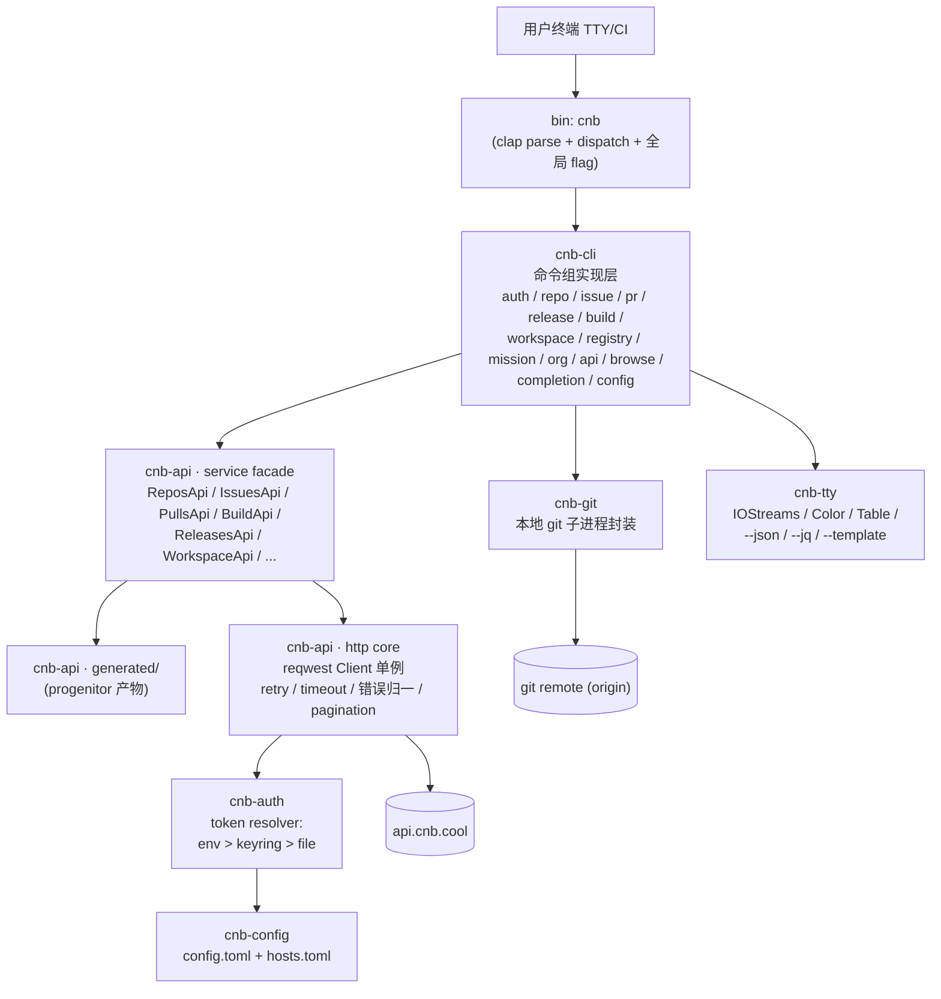
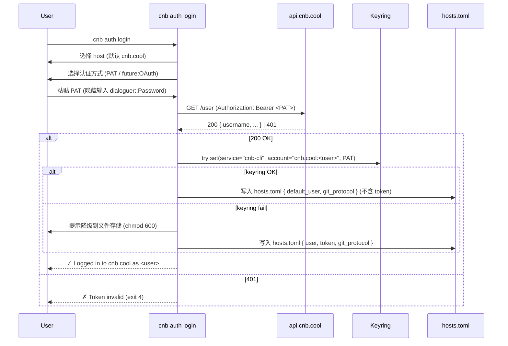

# CNB CLI 设计文档（v0.1）

> 项目：`cnb` —— 面向 [CNB（CloudNative Build, cnb.cool）](https://cnb.cool) 平台的官方风格命令行工具，使用 Rust 实现，对齐 GitHub `gh` 的资源-动作命令模型。
>
> 文档版本：v0.1（M0 设计冻结）｜ 适用范围：v0.x ~ v1.0｜ 后续编码以本文档为唯一蓝本。

---

## 0. 文档状态（请先读 — 2026-05-12 更新）

> **本文档是 M0 阶段（2026-04，"设计冻结"）的架构快照。**
> 它记录了项目启动时的设计意图、决策依据和路线图，是项目的**史料档案**而非实时镜像。后续 milestone 的实施过程中，工程现状已经在多个维度上**演进、超越甚至偏离**了 §3–§16 描述的形态——这是健康的、由真实约束驱动的演化，不是"DESIGN 失效"。
>
> 当你需要以下信息时，请直接看更准确的来源：
>
> | 你想了解 | 看这里（**当前态**） | 而不是这里（M0 设计意图） |
> |--------|------------------|---------------------|
> | 当前 workspace shape / crate 列表 | [`README.md`](README.md) §"Crate map (current)" | DESIGN §3 / §4 |
> | HTTP 客户端 / 错误模型 / facade 实现 | [`docs/sdk-0.2.2-upgrade.md`](docs/sdk-0.2.2-upgrade.md) §6 | DESIGN §6 / §9.3 |
> | 仍未完成的 open items | [`docs/known-gaps.md`](docs/known-gaps.md) | DESIGN §15 / §16 |
> | SDK 上游问题与解决进度 | [`docs/sdk-issues.md`](docs/sdk-issues.md) + [`docs/upstream-issues/`](docs/upstream-issues/) | — |
> | 用户向使用文档 | [`docs/src/`](docs/src/)（mdbook handbook） | — |
> | 版本历史 | [`CHANGELOG.md`](CHANGELOG.md) | — |
>
> **最重要的偏离**（本节 = "DESIGN reader 必知的 4 件事"）：
>
> 1. **`cnb-api` crate 已退役**（commit `9547335`，2026-05-11）。本文档里所有"`cnb-api` · service facade / http core / generated"的描述都是历史。当前所有 HTTP 流量直接走外部 typed SDK `cnb-sdk`（即 crates.io 的 `cnb` 0.2.x，workspace 里 alias 为 `cnb-sdk` 避开与本 bin 同名冲突）。`cnb api` raw passthrough 与 `cnb issue --attach` 的 multipart upload 这两个 SDK 不建模的小流，搬到了 `crates/cnb-cli/src/http/`，复用 SDK 共享的 reqwest client。
> 2. **workspace 由 8 → 6 crates**：`cnb / cnb-cli / cnb-auth / cnb-config / cnb-git / cnb-tty / xtask`（外加 `xtask` 不算业务 crate）。`cnb-api` 已删，`cnb-graphql`（DESIGN §16 #8 "未来可能"）确认不做。
> 3. **OpenAPI → Rust 不再走 progenitor**（DESIGN §7 描述的本地生成方案）。改为依赖**上游已发布的 typed SDK**（`cnb-sdk`），`xtask sync-openapi` 这一类本地生成流水线不存在，相关的 `crates/cnb-api/generated/` 树也不存在。
> 4. **路线图 M0–M5 已交付**，M5.1（自动更新检查 + GitHub release 流水线）也已完成。仍 open 的项全部归类到 [`docs/known-gaps.md`](docs/known-gaps.md) 的 16 项"外部依赖型 open item"，本仓库内无单方面可解的 TODO。
>
> 其余 §1（目标 / 非目标 / 优先级）、§2（架构原则 / 总览图）、§5（认证子系统）、§8（命令清单与端点映射）、§10–§13（仓库上下文 / 输出 / 错误码 / 测试策略）、§14（构建分发）、附录 A/B/C 在工程意图层面**仍然有效**，可以放心阅读。

---

## 目录

1. [项目目标与非目标](#1-项目目标与非目标)
2. [整体架构](#2-整体架构)
3. [Cargo Workspace 与 Crate 划分](#3-cargo-workspace-与-crate-划分)
4. [关键依赖清单](#4-关键依赖清单)
5. [认证子系统](#5-认证子系统)
6. [HTTP 客户端](#6-http-客户端)
7. [OpenAPI → Rust 模型生成策略](#7-openapi--rust-模型生成策略)
8. [命令清单与端点映射](#8-命令清单与端点映射)
9. [配置文件设计](#9-配置文件设计)
10. [当前仓库上下文识别](#10-当前仓库上下文识别)
11. [输出与可脚本化](#11-输出与可脚本化)
12. [错误处理与退出码规范](#12-错误处理与退出码规范)
13. [测试策略](#13-测试策略)
14. [构建、分发与版本](#14-构建分发与版本)
15. [路线图（M0 ~ M6）](#15-路线图m0--m6)
16. [风险与未决事项](#16-风险与未决事项)
- [附录 A：按 tag 分组的完整端点清单](#附录-a按-tag-分组的完整端点清单)
- [附录 B：cnb 错误码对照表](#附录-b-cnb-错误码对照表)
- [附录 C：与 gh CLI 的对齐速查表](#附录-c-与-gh-cli-的对齐速查表)

---

## 1. 项目目标与非目标

### 1.1 目标（In Scope, v0.1 ~ v1.0）

- **统一的开发者终端入口**：在 macOS / Linux / Windows 终端完成 CNB 平台高频操作，无需打开浏览器。
- **完全对齐 `gh` 体验**：命令模型、flag 命名、输出风格、退出码、扩展机制均最大限度对齐 `gh`，降低 GitHub 用户迁移成本。
- **覆盖 14 大命令组**（MVP 即全部覆盖，按里程碑分批落地）：
  `auth / repo / issue / pr(mr) / release / build / workspace / registry / mission / org / api / browse / completion / config(+alias)`
- **OpenAPI 驱动**：基于 `https://api.cnb.cool/swagger.json`（179 endpoints / 29 tags）由代码生成器产出强类型客户端，命令层只面对类型化模型而非裸 JSON。
- **三级 Token 解析**：`CNB_TOKEN` 环境变量 > 系统 keyring > 文件 `~/.config/cnb/hosts.toml`，CI 与本地两端友好。
- **可脚本化**：所有列表/详情命令支持 `--json [fields]` / `--jq <expr>` / `--template <tpl>`，非 TTY 自动降级为无色 TSV。
- **可扩展**：`cnb api` 通用直连（类似 `gh api`），`cnb alias` 用户别名，未来 `cnb extension` 第三方扩展。

### 1.2 非目标（Out of Scope）

- **不重新发明 git**：所有需要操作本地 git 仓库的命令（clone / push / fetch / checkout）通过子进程调用系统 `git`，不引入 libgit2。
- **不实现 GraphQL**：CNB OpenAPI 当前仅提供 REST，不规划 GraphQL 客户端。如未来 CNB 上线 GraphQL，再增补。
- **不内置 IDE/编辑器**：`cnb workspace` 仅做云原生开发环境的生命周期管理与跳转 URL，不内嵌 web IDE。
- **不替代 git 凭据管理**：CLI 自身的 Token 与 git 远程凭据相互独立；后续可选提供 `cnb auth setup-git` 写入 `git credential helper`，但 v1.0 不强制。
- **不做 CRUD 的 100% 覆盖**：约 30% 的 OpenAPI 端点（如 badge 上传、内部安全概览、知识库管理、排行榜等）作为低频/平台化能力暂不暴露为顶层命令，仍可通过 `cnb api` 调用。

### 1.3 v0.1 MVP 验收口径

- 14 个命令组的核心动词（`list / view / create / edit / delete` 等）至少 70% 端点被命令直接覆盖；其余通过 `cnb api` 兜底。
- 三平台（macOS Apple Silicon、Linux x86_64、Windows x86_64）均提供官方二进制。
- 完整文档站（基于 mdbook 或 docusaurus）+ man pages + shell completion。

---

## 2. 整体架构

### 2.1 分层架构（Mermaid）



### 2.2 ASCII 简版分层图

```
┌───────────────────────────────────────────────────────────┐
│                     用户终端 (TTY / CI)                    │
└──────────────────────────┬────────────────────────────────┘
                           ▼
┌───────────────────────────────────────────────────────────┐
│  bin: cnb              clap v4 parse + global flags       │
│                        --repo / --json / --jq / -v ...    │
└──────────────────────────┬────────────────────────────────┘
                           ▼
┌───────────────────────────────────────────────────────────┐
│  cnb-cli (Command Layer, one mod per group)               │
│   auth · repo · issue · pr · release · build · workspace  │
│   registry · mission · org · api · browse · completion    │
│   config                                                  │
└────────┬─────────────┬──────────────┬─────────────────────┘
         ▼             ▼              ▼
┌────────────┐ ┌──────────────┐ ┌───────────────────────────┐
│  cnb-git   │ │   cnb-tty    │ │  cnb-api (Service Facade) │
│ git remote │ │ table/color  │ │ ReposApi / IssuesApi/...  │
│ clone/push │ │ json/jq/tpl  │ │       ▲                   │
└────────────┘ └──────────────┘ │       │                   │
                                │ ┌─────┴────────┐          │
                                │ │ generated/   │          │
                                │ │ (progenitor) │          │
                                │ └──────────────┘          │
                                │       ▼                   │
                                │ ┌──────────────┐          │
                                │ │ HTTP core    │          │
                                │ │ reqwest      │          │
                                │ │ retry/page   │          │
                                │ └──────┬───────┘          │
                                └────────┼──────────────────┘
                                         ▼
                                 ┌───────────────┐
                                 │  cnb-auth     │
                                 │ env>keyring>  │
                                 │ file resolver │
                                 └──────┬────────┘
                                        ▼
                                 ┌───────────────┐
                                 │  cnb-config   │
                                 │ config.toml + │
                                 │ hosts.toml    │
                                 └───────────────┘
```

### 2.3 关键调用链示例（`cnb issue list`）

```
$ cnb issue list --state open --label bug
  ↓ clap parse
bin/cnb::main → cnb_cli::issue::list::run(args, ctx)
  ↓ ctx.repo() (cnb-git: parse `git remote get-url origin`)
ctx.repo() = "cnb/feedback"
  ↓ ctx.api() (lazy init, 单例)
api.issues().list(repo="cnb/feedback", filter)  ── cnb-api facade
  ↓
http.get("/{repo}/-/issues", path={repo:"cnb/feedback"}, query={state, labels})
  ↓ Authorization: Bearer <token>  (cnb-auth resolver)
api.cnb.cool → 200 OK [Issue, Issue, ...]
  ↓
renderer.print_table(issues, columns=[number,title,state,assignees,updated])
  ↓ TTY? → comfy-table 彩色; 非 TTY → TSV; --json? → serde_json
```

---

## 3. Cargo Workspace 与 Crate 划分

工程采用 Cargo workspace，按职责分 crate，单元测试与发布粒度对齐 `gh` 的 `cmd/ + pkg/cmd/<group>/ + api/` 模式。

| Crate                | 类型     | 职责                                                                                          |
| -------------------- | -------- | --------------------------------------------------------------------------------------------- |
| `cnb`                | bin      | 二进制入口；只做 clap 解析、全局 flag、子命令派发、错误码映射                                 |
| `cnb-cli`            | lib      | 14 个命令组的实现层；每个命令组一个子 mod，每个动词一个文件                                   |
| `cnb-api`            | lib      | HTTP 客户端 + 错误模型 + service facade + `generated/`（progenitor 产物）                     |
| `cnb-config`         | lib      | `config.toml` / `hosts.toml` 读写、schema、迁移                                               |
| `cnb-auth`           | lib      | Token 三级解析与写入（env/keyring/file），`auth login/logout/status/token/switch` 业务逻辑    |
| `cnb-git`            | lib      | 本地 `git` 子进程封装：`remote get-url` / `clone` / `current-branch` / `push` / `fetch`       |
| `cnb-tty`            | lib      | IOStreams 抽象（stdin/stdout/stderr）、TTY 检测、颜色、表格、进度条、`--json/--jq/--template` |
| `cnb-update`（可选） | lib      | 版本检测与自更新提示（异步、不阻塞主命令）                                                    |
| `xtask`（可选）      | bin      | 构建辅助：`cargo xtask gen-openapi`（重生成 generated/）、`gen-completion`、`gen-manpages`    |

**目录布局**：

```
cnb/                                 # 工作区根
├── Cargo.toml                       # [workspace] members = [...]
├── DESIGN.md                        # 本文档
├── README.md
├── crates/
│   ├── cnb/                         # bin
│   │   └── src/main.rs
│   ├── cnb-cli/
│   │   └── src/
│   │       ├── lib.rs
│   │       ├── auth/{mod,login,logout,status,token,switch}.rs
│   │       ├── repo/{mod,view,list,create,clone,fork,delete,edit,
│   │       │        archive,unarchive,transfer,set_visibility}.rs
│   │       ├── issue/{...}.rs
│   │       ├── pr/{...}.rs
│   │       ├── release/{...}.rs
│   │       ├── build/{...}.rs
│   │       ├── workspace/{...}.rs
│   │       ├── registry/{...}.rs
│   │       ├── mission/{...}.rs
│   │       ├── org/{...}.rs
│   │       ├── api.rs               # 通用 REST 直连
│   │       ├── browse.rs
│   │       ├── completion.rs
│   │       └── config/{mod,get,set,list,edit,alias}.rs
│   ├── cnb-api/
│   │   └── src/
│   │       ├── lib.rs               # facade re-export
│   │       ├── client.rs            # Client 单例 + 注入
│   │       ├── error.rs             # ApiError, ErrCode
│   │       ├── pagination.rs        # AsyncIterator over pages
│   │       ├── retry.rs
│   │       ├── services/
│   │       │   ├── repos.rs
│   │       │   ├── issues.rs
│   │       │   ├── pulls.rs
│   │       │   ├── releases.rs
│   │       │   ├── build.rs
│   │       │   ├── workspace.rs
│   │       │   ├── registries.rs
│   │       │   ├── missions.rs
│   │       │   ├── organizations.rs
│   │       │   └── users.rs
│   │       └── generated/           # progenitor 产物（check in）
│   │           ├── mod.rs
│   │           └── ...
│   ├── cnb-config/
│   ├── cnb-auth/
│   ├── cnb-git/
│   ├── cnb-tty/
│   └── cnb-update/
├── xtask/
│   └── src/main.rs
├── openapi/
│   ├── cnb-swagger-2.0.json         # 上游 swagger，定期同步
│   └── cnb-openapi-3.0.json         # 由 swagger2openapi 转换产物
├── tests/                           # 集成测试（black-box 调用 cnb 二进制）
└── docs/                            # mdbook 文档源
```

---

## 4. 关键依赖清单

> 选型原则：Rust 原生优先 / 编译产物零运行时依赖 / 与 `gh` 体验对齐 / TLS 走 rustls 避免 OpenSSL 系统依赖。

### 4.1 核心运行时

| 用途        | crate                      | 版本    | 备注                                                         |
| ----------- | -------------------------- | ------- | ------------------------------------------------------------ |
| 异步运行时  | `tokio`                    | `1`     | features = `["macros","rt-multi-thread","fs","process","signal"]` |
| HTTP 客户端 | `reqwest`                  | `0.12`  | features = `["rustls-tls","json","stream","gzip","multipart"]`，**禁用** `default-features` 以剔除 native-tls |
| URL 处理    | `url`                      | `2`     | 安全的 path/query 构造（**禁止字符串拼接**）                 |
| 序列化      | `serde`,`serde_json`,`serde_with` | `1` / `1` / `3` | derive 全开                                          |

### 4.2 CLI / 输出

| 用途               | crate                      | 版本    | 备注                                              |
| ------------------ | -------------------------- | ------- | ------------------------------------------------- |
| 命令行框架         | `clap`                     | `4`     | features = `["derive","env","wrap_help","unicode"]` |
| Shell 补全生成     | `clap_complete`            | `4`     | 用于 `cnb completion`                             |
| 表格               | `comfy-table`              | `7`     | UTF-8 边框 + 颜色                                 |
| 颜色               | `owo-colors`               | `4`     | 零开销的 ANSI                                     |
| 进度条             | `indicatif`                | `0.17`  | 上传/下载/构建 watch                              |
| TTY 检测           | `is-terminal`              | `0.4`   | 决定颜色与表格风格                                |
| 交互问询           | `dialoguer`                | `0.11`  | `auth login` / `repo create` 等                   |
| 浏览器跳转         | `open`                     | `5`     | 跨平台 `xdg-open` / `open` / `start`              |
| jq 后处理          | `jaq-interpret` + `jaq-parse` + `jaq-core` | `1`     | 纯 Rust，无 C 依赖                |
| 模板               | `tinytemplate`             | `1`     | `--template` 输出                                 |
| Markdown 渲染（详情卡片） | `termimad`         | `0.30`  | issue/pr 详情正文                                 |

### 4.3 配置 / 凭据 / 路径

| 用途             | crate          | 版本   | 备注                                              |
| ---------------- | -------------- | ------ | ------------------------------------------------- |
| 系统凭据         | `keyring`      | `2`    | macOS Keychain / Win Credential / Secret Service  |
| TOML             | `toml`         | `0.8`  | 配置文件                                          |
| XDG 路径         | `directories`  | `5`    | `ProjectDirs::from("cool","cnb","cnb")`           |
| 文件锁           | `fs2`          | `0.4`  | 配置写入加锁                                      |

### 4.4 错误 / 日志

| 用途         | crate                     | 版本   | 备注                                                |
| ------------ | ------------------------- | ------ | --------------------------------------------------- |
| 库层错误     | `thiserror`               | `1`    | `cnb-api` / `cnb-auth` 等结构化错误                 |
| 顶层聚合     | `anyhow`                  | `1`    | `cnb` bin 收口                                      |
| 结构化日志   | `tracing` + `tracing-subscriber` | `0.1` / `0.3` | `-v`/`-vv` 控制级别              |

### 4.5 测试 / 构建

| 用途               | crate                          | 版本   | 备注                                       |
| ------------------ | ------------------------------ | ------ | ------------------------------------------ |
| HTTP mock          | `wiremock`                     | `0.6`  | service / facade 单测                      |
| CLI 黑盒           | `assert_cmd` + `predicates`    | `2` / `3` | `tests/` 集成测试                       |
| 快照               | `insta`                        | `1`    | 输出格式回归                               |
| 临时目录           | `tempfile`                     | `3`    | 配置/家目录隔离                            |
| OpenAPI 客户端生成 | `progenitor`                   | `0.7`  | build-time 或 xtask 生成                   |
| 跨平台发布         | `cargo-dist`（CLI 工具，非依赖） | latest | release artifacts 一键生成                 |
| CHANGELOG          | `git-cliff`（CLI 工具，非依赖） | latest | 基于 conventional commits                  |
| Swagger→OpenAPI3   | `swagger2openapi`（npm，非 Rust） | latest | 一次性转换，产物 check in                  |

### 4.6 安全约束（依赖侧）

- **禁用 OpenSSL/native-tls**：`reqwest` 锁定 rustls，避免在 macOS/Linux 因 OpenSSL 版本碎片化导致的发行问题。
- **Cargo audit/deny**：CI 中跑 `cargo audit` 与 `cargo deny check`，对 known CVE / GPL 依赖做硬阻断。
- **MSRV**：以 stable 最近 6 个月版本为底（如 1.78+），写入 `rust-toolchain.toml`。

---

## 5. 认证子系统

### 5.1 Token 类型与来源

| 来源                 | 优先级 | 推荐场景                        | 说明                                                       |
| -------------------- | ------ | ------------------------------- | ---------------------------------------------------------- |
| `CNB_TOKEN` env      | **1**  | CI / 容器 / 自动化              | 设置后 **跳过** keyring/file，且不写入任何持久化           |
| 系统 keyring         | **2**  | 本地交互式开发                  | service=`cnb-cli`, account=`<host>:<username>`             |
| `~/.config/cnb/hosts.toml` | **3** | WSL / 远程容器 / keyring 不可用 | 文件权限强制 `0600`；写入前提示用户安全风险                |

> **决策**：三级解析顺序固化为 **env > keyring > file**，不允许通过配置反转，避免 CI 误读本地 token。

### 5.2 `cnb auth` 命令族

```
cnb auth login    [--hostname HOST] [--with-token] [--git-protocol https|ssh]
cnb auth logout   [--hostname HOST] [--user USER]
cnb auth status   [--hostname HOST] [--show-token]
cnb auth token    [--hostname HOST] [--user USER]              # 仅打印当前 token，便于脚本拼接
cnb auth switch   [--hostname HOST] --user USER                # 多账号切换
cnb auth setup-git [--hostname HOST]                           # 可选：写入 git credential helper
```

### 5.3 `auth login` 流程图



### 5.4 Token 解析伪代码

```rust
// cnb-auth/src/resolver.rs
pub fn resolve_token(host: &str, user: Option<&str>) -> Result<TokenSource> {
    // 1. env
    if let Ok(t) = env::var("CNB_TOKEN") {
        return Ok(TokenSource::Env(t));
    }
    // 2. keyring
    let user = user.or_else(|| Hosts::load().ok()?.default_user(host)).ok_or(Error::NoUser)?;
    if let Ok(entry) = keyring::Entry::new("cnb-cli", &format!("{host}:{user}")) {
        if let Ok(t) = entry.get_password() {
            return Ok(TokenSource::Keyring { host, user, token: t });
        }
    }
    // 3. file
    if let Some(t) = Hosts::load()?.token(host, &user) {
        return Ok(TokenSource::File { host, user, token: t });
    }
    Err(Error::NotLoggedIn)
}
```

### 5.5 安全约束（认证侧）

- Token **永不写入** `tracing` 日志；`reqwest` 中间件对 `Authorization` 头做 redaction。
- 错误响应体中若包含 token 子串（如 echo），落盘前做 `***` 替换。
- `hosts.toml` 写入时 `chmod 0600`（Unix）；Windows 通过 ACL 限制为当前用户。
- `cnb auth status --show-token` 必须显式 flag，且仅在 TTY 下输出，避免 redirect 泄漏。

---

## 6. HTTP 客户端

### 6.1 设计原则

- **单例 Client**：全局 `OnceCell<reqwest::Client>`，复用 TCP / TLS 连接池。
- **零字符串拼接 URL**：使用 `url::Url::path_segments_mut()` 添加 path 段；query 用 `RequestBuilder::query()`。**这是硬性安全规则**。
- **统一错误模型**：所有响应（含网络错误、4xx、5xx、解析失败）汇聚到 `ApiError`。
- **Bearer 注入**：通过自定义 middleware（`reqwest-middleware`）或 wrapper 在每次请求注入 `Authorization`，请求构造侧不感知 token。
- **重试**：仅对 **幂等方法**（GET/HEAD/PUT/DELETE）+ 5xx / 429 / 网络抖动 重试，指数退避（base 200ms，cap 5s，max 3 次）。POST/PATCH 默认不重试。
- **超时**：连接 10s，整体 60s，可被 `--timeout SEC` / 配置覆盖。
- **限流**：识别响应头中 `Retry-After`（如有），优先按其指示退避。

### 6.2 错误模型

```rust
// cnb-api/src/error.rs
#[derive(Debug, thiserror::Error)]
pub enum ApiError {
    #[error("network error: {0}")]
    Network(#[from] reqwest::Error),

    #[error("API error [{errcode}] {errmsg} (HTTP {http_status}, request_id={request_id:?})")]
    Api {
        errcode: i64,
        errmsg: String,
        http_status: u16,
        request_id: Option<String>,
        raw: serde_json::Value,         // 原始体，用于 -vv 调试
    },

    #[error("unauthorized: please run `cnb auth login`")]
    Unauthorized,                       // errcode=16 / HTTP 401

    #[error("not found")]
    NotFound,                           // errcode=5 / HTTP 404

    #[error("rate limited (retry after {retry_after_sec}s)")]
    RateLimited { retry_after_sec: u64 },

    #[error("decode error: {0}")]
    Decode(#[from] serde_json::Error),

    #[error("invalid token storage: {0}")]
    Auth(String),
}
```

### 6.3 高低阶 API 双层

```
┌───────────────────────────────────────────┐
│  cnb-cli (命令层)                          │
└────────┬──────────────────────────────────┘
         │
         ▼
┌───────────────────────────────────────────┐
│  Service Facade (人体工学)                 │
│  api.issues().list(repo, filter)          │
│  api.pulls().merge(repo, num, opts)       │
└────────┬──────────────────────────────────┘
         │ 委托
         ▼
┌───────────────────────────────────────────┐
│  generated/ (progenitor 产物，强类型)      │
│  CnbClient::repo_issues_list(...)         │
└────────┬──────────────────────────────────┘
         │
         ▼
┌───────────────────────────────────────────┐
│  HTTP Core                                 │
│  Client + Auth + Retry + Pagination        │
└───────────────────────────────────────────┘
```

- **低阶**：progenitor 自动生成，类型严格但参数列表长。
- **高阶**：手写 facade，按业务聚合参数（如 `IssueFilter` builder），稳定 API 抗住 OpenAPI 升级。

### 6.4 分页

CNB 多数列表接口约定 `?page=N&page_size=M`（M2 时通过抓取若干 spec 端点的 parameters 字段最终确认；若不一致，在 facade 内适配）。提供：

```rust
pub struct Pager<T> { /* ... */ }
impl<T: DeserializeOwned> Pager<T> {
    pub async fn next_page(&mut self) -> Result<Option<Vec<T>>>;
    pub fn into_stream(self) -> impl Stream<Item = Result<T>>;
}
```

CLI 层默认拉首页（30 条）；`--paginate` 触发全量；`--limit N` 截断。

### 6.5 中间件链

```
request
  │
  ├─► auth_inject       (Authorization: Bearer + User-Agent)
  ├─► tracing_span      (method/path/request_id, 隐去 token)
  ├─► retry             (指数退避 / Retry-After)
  └─► error_normalize   (errcode → ApiError 变体)
response
```

---

## 7. OpenAPI → Rust 模型生成策略

### 7.1 现状

- 上游：`https://api.cnb.cool/swagger.json` —— **Swagger 2.0**（OpenAPI 3.0 之前的规范），179 个端点，使用 `BearerAuth`（apiKey in header）。
- spec **未声明** `host` / `basePath` / `schemes`，CLI 侧默认补齐 `https://api.cnb.cool`。

### 7.2 工具链选型

| 候选                    | 决策   | 理由                                                              |
| ----------------------- | ------ | ----------------------------------------------------------------- |
| `openapi-generator-cli` | ❌ 否  | 依赖 Java / Maven，发行复杂；生成代码冗余、async 支持参差         |
| `paperclip`             | ❌ 否  | Swagger 2.0 优势不再，社区维护放缓                                |
| **`progenitor`**        | ✅ 是  | Oxide 出品，纯 Rust；async + reqwest；类型 idiomatic；生成期可控  |

### 7.3 生成流程（一次性 + 可重复）

```bash
# Step 1: 拉取最新 swagger（人工或 CI 周期）
curl -s https://api.cnb.cool/swagger.json -o openapi/cnb-swagger-2.0.json

# Step 2: Swagger 2.0 → OpenAPI 3.0（progenitor 仅支持 3.0）
npx -y swagger2openapi openapi/cnb-swagger-2.0.json \
    -o openapi/cnb-openapi-3.0.json --yaml false

# Step 3: 触发生成
cargo xtask gen-openapi
# 等价于在 xtask 中调用 progenitor::Generator，输出到
#   crates/cnb-api/src/generated/
```

### 7.4 生成配置约定

- **interface**：`reqwest::Client`（async）
- **inner_type**：`Box<reqwest::Client>` 或包装我们自己的 `Client`
- **derive**：`Debug, Clone, Serialize, Deserialize`
- **post-processor**：xtask 中跑 `rustfmt` + `cargo check`，失败即视为生成失败
- **commit policy**：`generated/` **check in 仓库**，CI 校验 `git diff --exit-code` 防止人工漂移

### 7.5 Facade 层职责

- 把 `progenitor` 生成的细粒度方法（参数动辄 6~10 个）聚合为 `Filter` builder + 高阶方法。
- 吸收 OpenAPI breaking change（字段重命名、参数移位），命令层稳定不动。
- 提供分页 `Pager<T>` 包装。
- 注入统一 retry / auth 中间件（progenitor 的 inner client 由 facade 持有）。

### 7.6 Spec 同步策略

- 在 `xtask` 中提供 `cargo xtask sync-openapi`：拉取最新 swagger → 转 3.0 → 生成 → `cargo check` → 输出 diff 摘要供人工 review。
- CI 周期任务（每周一次）自动跑同步并开 PR；human-in-the-loop 合并。

---

（**第 8 章命令清单与端点映射** 见下一节，因篇幅独立分组列出）


---

## 8. 命令清单与端点映射

> **约定**：
>
> - 全局 flag（所有命令均可用）：`--repo OWNER/REPO`、`--hostname HOST`、`--json [fields]`、`--jq <expr>`、`--template <tpl>`、`-v/-vv`、`--help`。
> - `{repo}` 占位符的实际值是 `owner/repo` 形式的 slug（例：`cnb/feedback`）。
> - 端点列只列首版 CLI 实际要使用的端点；其余 OpenAPI 端点见 [附录 A](#附录-a按-tag-分组的完整端点清单)，可通过 `cnb api` 兜底访问。
> - "里程碑" 列对应 [§15 路线图](#15-路线图m0--m6)。

### 8.1 `cnb auth` —— 认证

| 子命令              | 功能描述                                                  | 关键 flag                                       | 关联端点                            | 里程碑 |
| ------------------- | --------------------------------------------------------- | ----------------------------------------------- | ----------------------------------- | ------ |
| `cnb auth login`    | 交互式登录（粘贴 PAT，校验后写入 keyring/file）           | `--hostname` `--with-token` `--git-protocol`    | `GET /user`（校验）                 | M1     |
| `cnb auth logout`   | 删除指定 host/user 的 token                               | `--hostname` `--user`                           | —                                   | M1     |
| `cnb auth status`   | 显示当前登录状态、token 来源、用户名                      | `--hostname` `--show-token`                     | `GET /user`                         | M1     |
| `cnb auth token`    | 仅打印当前 token（脚本拼接用）                            | `--hostname` `--user`                           | —                                   | M1     |
| `cnb auth switch`   | 多账号切换默认用户                                        | `--hostname` `--user`                           | —                                   | M2     |
| `cnb auth setup-git`| 写入 git credential helper（可选）                        | `--hostname`                                    | —                                   | M4     |

### 8.2 `cnb repo` —— 仓库

| 子命令                         | 功能描述                                            | 关键 flag                                              | 关联端点                                                                                  | 里程碑 |
| ------------------------------ | --------------------------------------------------- | ------------------------------------------------------ | ----------------------------------------------------------------------------------------- | ------ |
| `cnb repo list [USER\|ORG]`    | 列出当前用户/指定用户/组织的仓库                    | `--limit` `--paginate` `--visibility` `--permission`   | `GET /user/repos`、`GET /users/{username}/repos`、`GET /{slug}/-/repos`                   | M2     |
| `cnb repo view [REPO]`         | 查看仓库元信息（名/描述/默认分支/star/topic）       | `--web`（在浏览器打开）                                | `GET /{repo}`                                                                             | M2     |
| `cnb repo create <NAME>`       | 在指定 group 下创建仓库                             | `--group` `--public/--private/--internal` `--desc` `--license` `--clone` | `POST /{slug}/-/repos`                                                          | M2     |
| `cnb repo clone REPO [DIR]`    | clone 仓库到本地（自动注入 token 到 https URL）     | `--depth` `--`（透传 git）                             | （本地 git，无 API）                                                                       | M2     |
| `cnb repo fork [REPO]`         | fork 仓库 / 列出 fork                               | `--clone`                                              | `GET /{repo}/-/forks`（list）；fork 创建走 `cnb api`（spec 未单列）                       | M2     |
| `cnb repo delete [REPO]`       | 删除仓库（强制二次确认）                            | `--yes`                                                | `DELETE /{repo}`                                                                          | M2     |
| `cnb repo edit [REPO]`         | 修改简介 / 站点 / 主题 / license                    | `--description` `--homepage` `--add-topic` `--license` | `PATCH /{repo}`                                                                           | M2     |
| `cnb repo archive [REPO]`      | 归档仓库                                            | `--yes`                                                | `POST /{slug}/-/settings/archive`                                                         | M2     |
| `cnb repo unarchive [REPO]`    | 解除归档                                            | —                                                      | `POST /{slug}/-/settings/unarchive`                                                       | M2     |
| `cnb repo transfer [REPO]`     | 转移仓库到新 owner                                  | `--to OWNER`                                           | `POST /{repo}/-/transfer`                                                                 | M2     |
| `cnb repo set-visibility [REPO]` | 切换仓库可见性                                    | `public\|private\|internal`                            | `POST /{repo}/-/settings/set_visibility`                                                  | M2     |
| `cnb repo star [REPO]` / `unstar` | star / 取消 star                                 | —                                                      | （走 `cnb api`，spec 未单列）                                                              | M3     |
| `cnb repo list-stars [REPO]`   | 仓库的 star 用户列表                                | `--limit`                                              | `GET /{slug}/-/stars`                                                                     | M3     |
| `cnb repo list-stared`         | 当前用户 star 的仓库列表                            | `--limit`                                              | `GET /user/stared-repos`                                                                  | M3     |
| `cnb repo collaborator list` / `add` / `remove` / `update` | 外部协作者管理               | `--permission read\|write\|admin`                      | `GET /{slug}/-/outside-collaborators`、`PUT /{slug}/-/outside-collaborators/{username}`、`DELETE /{slug}/-/outside-collaborators/{username}` | M4 |
| `cnb repo pin set` / `list`    | 组织仓库墙（pinned-repos）                          | `--repos OWNER/REPO,...`                               | `GET /{slug}/-/pinned-repos`、`PUT /{slug}/-/pinned-repos`                                | M4     |
| `cnb repo activity`            | 仓库 top 活跃用户                                   | `--limit`                                              | `GET /{repo}/-/top-activity-users`                                                        | M4     |
| `cnb repo contributors`        | 贡献者趋势                                          | —                                                      | `GET /{slug}/-/contributor/trend`                                                         | M4     |

### 8.3 `cnb issue` —— 议题

| 子命令                                  | 功能描述                                       | 关键 flag                                                  | 关联端点                                                                                    | 里程碑 |
| --------------------------------------- | ---------------------------------------------- | ---------------------------------------------------------- | ------------------------------------------------------------------------------------------- | ------ |
| `cnb issue list`                        | 列出仓库 issue                                 | `--state open\|closed\|all` `--label` `--assignee` `--author` `--limit` | `GET /{repo}/-/issues`                                                              | M2     |
| `cnb issue list --me`                   | 列出我相关的 issue（跨仓库）                   | `--state` `--limit`                                        | `GET /user/issues`                                                                          | M2     |
| `cnb issue view <NUMBER>`               | 查看 issue 详情                                | `--web` `--comments`                                       | `GET /{repo}/-/issues/{number}`、`GET /{repo}/-/issues/{number}/comments`                  | M2     |
| `cnb issue create`                      | 新建 issue（编辑器或 flag）                    | `--title` `--body` `--body-file` `--label` `--assignee`    | `POST /{repo}/-/issues`                                                                     | M2     |
| `cnb issue edit <NUMBER>`               | 编辑 issue                                     | `--title` `--body` `--add-label` `--remove-label` `--add-assignee` | `PATCH /{repo}/-/issues/{number}`、 `assignees/labels` 子接口                       | M2     |
| `cnb issue close <NUMBER>` / `reopen`   | 关闭 / 重开                                    | `--reason completed\|not_planned`                          | `PATCH /{repo}/-/issues/{number}`（state 字段）                                             | M2     |
| `cnb issue comment <NUMBER>`            | 添加评论                                       | `--body` `--body-file` `--editor`                          | `POST /{repo}/-/issues/{number}/comments`                                                   | M2     |
| `cnb issue comment list/edit/delete`    | 评论列表 / 修改                                | `--comment-id`                                             | `GET\|PATCH /{repo}/-/issues/{number}/comments[/{id}]`                                      | M2     |
| `cnb issue assign <NUMBER>` / `unassign`| 处理人增删                                     | `--add USER,...` `--remove USER,...`                       | `POST\|DELETE /{repo}/-/issues/{number}/assignees`                                          | M2     |
| `cnb issue label add/remove/set/clear`  | 标签操作                                       | `--label NAME,...`                                         | `POST\|DELETE\|PUT /{repo}/-/issues/{number}/labels[/{name}]`                               | M2     |
| `cnb issue activity <NUMBER>`           | issue timeline                                 | `--since-id`                                               | `GET /{repo}/-/issues/{number}/activities[/latest/{id}]`                                    | M3     |
| `cnb issue properties <NUMBER>` / `set` | issue 自定义属性                               | `--prop key=value`                                         | `GET\|PATCH /{repo}/-/issues/{number}/property`                                             | M3     |
| `cnb label list` / `create` / `edit` / `delete` | 仓库标签管理                          | `--name` `--color` `--description`                         | `GET\|POST\|PATCH\|DELETE /{repo}/-/labels[/{name}]`                                        | M2     |

> 文件/图片附件上传走 `POST /{repo}/-/upload/files|imgs` → 拿 url → `PUT` 流式上传，再把 asset_link 注入 body；CLI 包成 `--attach FILE` 透明处理。

### 8.4 `cnb pr` (alias `cnb mr`) —— 合并请求

| 子命令                              | 功能描述                                           | 关键 flag                                                | 关联端点                                                                                  | 里程碑 |
| ----------------------------------- | -------------------------------------------------- | -------------------------------------------------------- | ----------------------------------------------------------------------------------------- | ------ |
| `cnb pr list`                       | 合并请求列表                                       | `--state` `--label` `--assignee` `--author` `--head` `--base` `--limit` | `GET /{repo}/-/pulls`                                                       | M2     |
| `cnb pr view <NUMBER>`              | 详情 + 评论 + 提交 + 文件                          | `--web` `--comments` `--commits` `--files`               | `GET /{repo}/-/pulls/{number}`、`/comments`、`/commits`、`/files`                         | M2     |
| `cnb pr create`                     | 创建合并请求                                       | `--title` `--body` `--head` `--base` `--draft` `--reviewer` `--assignee` `--label` | `POST /{repo}/-/pulls`                                                  | M2     |
| `cnb pr edit <NUMBER>`              | 编辑                                               | 同 issue edit + `--add-reviewer`                         | `PATCH /{repo}/-/pulls/{number}`                                                          | M2     |
| `cnb pr close <NUMBER>` / `reopen`  | 关闭 / 重开                                        | —                                                        | `PATCH /{repo}/-/pulls/{number}`（state 字段）                                            | M2     |
| `cnb pr merge <NUMBER>`             | 合并                                               | `--squash\|--rebase\|--merge` `--delete-branch`          | （走 spec 中 update / merge 相关端点；M2 时核对具体 path 后定稿）                          | M2     |
| `cnb pr diff <NUMBER>`              | 输出 diff                                          | `--name-only`                                            | `GET /{repo}/-/pulls/{number}/files`                                                      | M2     |
| `cnb pr commits <NUMBER>`           | 提交列表                                           | —                                                        | `GET /{repo}/-/pulls/{number}/commits`                                                    | M2     |
| `cnb pr checks <NUMBER>`            | 状态检查                                           | —                                                        | `GET /{repo}/-/pulls/{number}/commit-statuses`                                            | M3     |
| `cnb pr checkout <NUMBER>`          | 切到对应分支（本地 git）                           | `--detach`                                               | `GET /{repo}/-/pulls/{number}` + 本地 git fetch/checkout                                  | M2     |
| `cnb pr comment <NUMBER>`           | 添加评论                                           | `--body` `--body-file`                                   | `POST /{repo}/-/pulls/{number}/comments`                                                  | M2     |
| `cnb pr comment list/edit`          | 评论列表 / 修改                                    | `--comment-id`                                           | `GET\|PATCH /{repo}/-/pulls/{number}/comments[/{id}]`                                     | M2     |
| `cnb pr assign/unassign`            | 处理人增删                                         | `--add` `--remove`                                       | `POST\|DELETE /{repo}/-/pulls/{number}/assignees`                                         | M2     |
| `cnb pr label add/remove/set/clear` | 标签                                               | —                                                        | `/{repo}/-/pulls/{number}/labels` 系列                                                    | M2     |
| `cnb pr review <NUMBER>`            | 提交 review（approve/request-changes/comment）     | `--approve\|--request-changes\|--comment` `--body`       | （走 spec 中 review 相关端点；M2 核对后定稿）                                              | M3     |
| `cnb pr batch <N1> <N2>...`         | 按 number 列表批量查询                             | —                                                        | `GET /{repo}/-/pull-in-batch`                                                             | M3     |

### 8.5 `cnb release` —— 发布

| 子命令                                  | 功能描述                                       | 关键 flag                                              | 关联端点                                                                                    | 里程碑 |
| --------------------------------------- | ---------------------------------------------- | ------------------------------------------------------ | ------------------------------------------------------------------------------------------- | ------ |
| `cnb release list`                      | release 列表                                   | `--limit` `--paginate`                                 | `GET /{repo}/-/releases`                                                                    | M3     |
| `cnb release view <TAG\|--id ID>`       | 详情（含附件）                                 | `--web` `--id`                                         | `GET /{repo}/-/releases/tags/{tag}` 或 `GET /{repo}/-/releases/{release_id}`                | M3     |
| `cnb release view --latest`             | 最新 release                                   | —                                                      | `GET /{repo}/-/releases/latest`                                                             | M3     |
| `cnb release create <TAG>`              | 创建 release                                   | `--title` `--notes` `--notes-file` `--draft` `--prerelease` `--target SHA` `--asset FILE,...` | `POST /{repo}/-/releases` + asset 上传链 | M3     |
| `cnb release edit <ID\|TAG>`            | 编辑                                           | 同 create                                              | `PATCH /{repo}/-/releases/{release_id}`                                                     | M3     |
| `cnb release delete <ID\|TAG>`          | 删除                                           | `--yes`                                                | `DELETE /{repo}/-/releases/{release_id}`                                                    | M3     |
| `cnb release upload <ID\|TAG> FILE...`  | 上传附件（流式）                               | `--clobber`                                            | `POST .../asset-upload-url` → PUT 流式 → `POST .../asset-upload-confirmation/...`           | M3     |
| `cnb release download <TAG>`            | 下载 release 附件                              | `--pattern GLOB` `--output DIR`                        | `GET /{repo}/-/releases/download/{tag}/{filename}` (302)                                    | M3     |
| `cnb release asset list/view/delete`    | 附件管理                                       | `--asset-id`                                           | `GET\|DELETE /{repo}/-/releases/{release_id}/assets/{asset_id}`                             | M3     |

### 8.6 `cnb build` —— 流水线

| 子命令                              | 功能描述                                       | 关键 flag                                              | 关联端点                                                       | 里程碑 |
| ----------------------------------- | ---------------------------------------------- | ------------------------------------------------------ | -------------------------------------------------------------- | ------ |
| `cnb build run`                     | 触发一次构建                                   | `--branch` `--ref` `--pipeline NAME` `--param KEY=VAL` | `POST /{repo}/-/build/start`                                   | M3     |
| `cnb build list`                    | 构建列表                                       | `--branch` `--status` `--limit` `--paginate`           | `GET /{repo}/-/build/logs`                                     | M3     |
| `cnb build status <SN>`             | 查询某次构建状态                               | `--watch`（轮询，配合 indicatif）                      | `GET /{repo}/-/build/status/{sn}`                              | M3     |
| `cnb build view <SN>`               | 构建详情（含各 stage）                         | `--stage STAGE_ID` `--pipeline-id ID`                  | `GET /{repo}/-/build/logs/stage/{sn}/{pipelineId}/{stageId}`   | M3     |
| `cnb build logs <SN>`               | 拉取/下载日志                                  | `--pipeline-id ID` `--output FILE`                     | `GET /{repo}/-/build/runner/download/log/{pipelineId}`         | M3     |
| `cnb build cancel <SN>`             | 取消构建                                       | —                                                      | `POST /{repo}/-/build/stop/{sn}`                               | M3     |
| `cnb build delete-logs <SN>`        | 删除日志                                       | `--yes`                                                | `DELETE /{repo}/-/build/logs/{sn}`                             | M3     |
| `cnb build crontab sync <BRANCH>`   | 同步分支下定时任务                             | —                                                      | `POST /{repo}/-/build/crontab/sync/{branch}`                   | M3     |

### 8.7 `cnb workspace` (alias `cnb ws`) —— 云原生开发环境

| 子命令                          | 功能描述                                         | 关键 flag                                  | 关联端点                                       | 里程碑 |
| ------------------------------- | ------------------------------------------------ | ------------------------------------------ | ---------------------------------------------- | ------ |
| `cnb workspace list`            | 我的工作空间列表                                 | `--limit`                                  | `GET /workspace/list`                          | M3     |
| `cnb workspace start [REPO]`    | 启动/打开工作空间（自动 `--web` 在浏览器打开）   | `--branch` `--no-open`                     | `POST /{repo}/-/workspace/start`               | M3     |
| `cnb workspace view --sn SN`    | 通过流水线 sn 拿访问地址                         | `--web`                                    | `GET /{repo}/-/workspace/detail/{sn}`          | M3     |
| `cnb workspace stop --sn SN`    | 停止                                             | —                                          | `POST /workspace/stop`                         | M3     |
| `cnb workspace delete --sn SN`  | 删除                                             | `--yes`                                    | `POST /workspace/delete`                       | M3     |

### 8.8 `cnb registry` —— 制品库

| 子命令                                         | 功能描述                                       | 关键 flag                                  | 关联端点                                                                                | 里程碑 |
| ---------------------------------------------- | ---------------------------------------------- | ------------------------------------------ | --------------------------------------------------------------------------------------- | ------ |
| `cnb registry list [GROUP]`                    | 组织下制品仓库列表                             | `--limit`                                  | `GET /{slug}/-/registries`                                                              | M4     |
| `cnb registry delete REGISTRY`                 | 删除制品仓库                                   | `--yes`                                    | `DELETE /{registry}`                                                                    | M4     |
| `cnb registry set-visibility REGISTRY`         | 修改可见性                                     | `public\|private\|internal`                | `POST /{registry}/-/settings/set_visibility`                                            | M4     |
| `cnb registry package list [GROUP]`            | 制品列表                                       | `--type npm\|maven\|docker\|helm\|...`     | `GET /{slug}/-/packages`                                                                | M4     |
| `cnb registry package view --type T --name N`  | 制品详情                                       | —                                          | `GET /{slug}/-/packages/{type}/{name}`                                                  | M4     |
| `cnb registry package delete`                  | 删除制品                                       | `--yes`                                    | `DELETE /{slug}/-/packages/{type}/{name}`                                               | M4     |
| `cnb registry tag list`                        | 制品标签列表                                   | —                                          | `GET /{slug}/-/packages/{type}/{name}/-/tags`                                           | M4     |
| `cnb registry tag view --tag T`                | 标签详情                                       | —                                          | `GET /{slug}/-/packages/{type}/{name}/-/tag/{tag}`                                      | M4     |
| `cnb registry tag delete --tag T`              | 删除标签                                       | `--yes`                                    | `DELETE /{slug}/-/packages/{type}/{name}/-/tag/{tag}`                                   | M4     |
| `cnb registry tag provenance --tag T`          | 标签出生证明（SLSA）                           | —                                          | `GET /{slug}/-/packages/{type}/{name}/-/tag/{tag}/provenance`                           | M4     |

### 8.9 `cnb mission` —— 任务集

| 子命令                                  | 功能描述                                       | 关键 flag                                  | 关联端点                                                  | 里程碑 |
| --------------------------------------- | ---------------------------------------------- | ------------------------------------------ | --------------------------------------------------------- | ------ |
| `cnb mission delete <MISSION>`          | 删除任务集                                     | `--yes`                                    | `DELETE /{mission}`                                       | M4     |
| `cnb mission view-list <MISSION>`       | 视图列表                                       | —                                          | `GET /{mission}/-/mission/view-list`                      | M4     |
| `cnb mission view-add/edit <MISSION>`   | 新增 / 修改视图                                | `--name` `--config-file`                   | `PUT /{mission}/-/mission/view-list`                      | M4     |
| `cnb mission view-sort <MISSION>`       | 排序视图                                       | `--ids ID1,ID2,...`                        | `POST /{mission}/-/mission/view-list`                     | M4     |
| `cnb mission view get/set <MISSION>`    | 视图配置查 / 改                                | `--config-file`                            | `GET\|POST /{mission}/-/mission/view`                     | M4     |

> 任务集其余端点（如 view-delete 单点）若 spec 暴露则在 M4 期间补齐。

### 8.10 `cnb org` (含 `member`) —— 组织与成员

| 子命令                                    | 功能描述                                       | 关键 flag                                  | 关联端点（基于 Organizations/Members tag，共 32 个，详见附录 A）| 里程碑 |
| ----------------------------------------- | ---------------------------------------------- | ------------------------------------------ | -------------------------------------------------------------- | ------ |
| `cnb org list`                            | 我加入的组织                                   | —                                          | `GET /groups`                                                   | M4     |
| `cnb org view <GROUP>`                    | 组织详情                                       | `--web`                                    | `GET /{group}`                                                  | M4     |
| `cnb org member list <GROUP>`             | 成员列表                                       | `--role` `--limit`                         | `GET /{group}/-/members`                                        | M4     |
| `cnb org member add <GROUP> <USER>`       | 添加成员                                       | `--role read\|write\|admin`                | `POST /{group}/-/members`                                       | M4     |
| `cnb org member remove <GROUP> <USER>`    | 移除                                           | `--yes`                                    | `DELETE /{group}/-/members/{username}`                          | M4     |
| `cnb org member edit <GROUP> <USER>`      | 修改角色                                       | `--role`                                   | `PATCH /{group}/-/members/{username}`                           | M4     |
| `cnb follower list [USER]` / `following`  | 粉丝 / 关注                                    | —                                          | `GET /users/{username}/followers`、`/following`                 | M4     |

> Organizations / Members 共 32 个端点，超出 MVP 必要范围；上表覆盖核心动词，其余通过 `cnb api` 调用，M5 视使用反馈再分批暴露。

### 8.11 `cnb api` —— 通用 REST 直连（对齐 `gh api`）

| 用法                                                         | 说明                                                       |
| ------------------------------------------------------------ | ---------------------------------------------------------- |
| `cnb api PATH`                                               | GET 请求，自动注入 Bearer                                  |
| `cnb api -X METHOD PATH`                                     | 指定 HTTP 方法                                             |
| `cnb api PATH -f key=value -f key2=value2`                   | 字段（POST/PATCH/PUT 默认按 JSON body 编码）               |
| `cnb api PATH -F key=@file.json`                             | 字段值从文件读取                                           |
| `cnb api PATH -H "Header: Value"`                            | 追加自定义 header                                          |
| `cnb api PATH --paginate`                                    | 自动翻页拼接                                               |
| `cnb api PATH --jq '.[] \| .name'`                           | jq 后处理                                                  |
| `cnb api PATH --template '{{range .}}{{.name}}\n{{end}}'`    | tinytemplate 渲染                                          |
| `cnb api PATH --hostname HOST`                               | 切换 host                                                  |
| `cnb api PATH -i`                                            | 输出响应头                                                 |
| `cnb api PATH --silent`                                      | 不输出 body（仅看退出码）                                  |

里程碑：**M1**（与 auth 同期，作为 MVP 的兜底能力）。

### 8.12 `cnb browse` —— 浏览器跳转

| 用法                                          | 说明                                       | 备注                                                         |
| --------------------------------------------- | ------------------------------------------ | ------------------------------------------------------------ |
| `cnb browse`                                  | 打开当前仓库主页                           | 解析 git remote → `https://cnb.cool/{owner}/{repo}`          |
| `cnb browse --repo OWNER/REPO`                | 指定仓库                                   | —                                                            |
| `cnb browse --branch BRANCH`                  | 打开分支视图                               | —                                                            |
| `cnb browse PATH`                             | 打开文件 / 目录                            | 接受相对 / 绝对 git 路径                                     |
| `cnb browse --issue N` / `--pr N`             | 跳到 issue / PR                            | —                                                            |
| `cnb browse --release [TAG]`                  | release 页                                 | —                                                            |
| `cnb browse --no-browser`                     | 仅打印 URL                                 | 与 `--web -n` 一致                                           |

里程碑：**M4**。

### 8.13 `cnb completion` —— Shell 补全

| 用法                                       | 说明                                                |
| ------------------------------------------ | --------------------------------------------------- |
| `cnb completion bash`                      | 输出 bash 补全脚本，重定向到 `~/.bash_completion.d` |
| `cnb completion zsh`                       | zsh                                                 |
| `cnb completion fish`                      | fish                                                |
| `cnb completion powershell`                | PowerShell                                          |
| `cnb completion --install`                 | 自动检测当前 shell 并安装到默认位置                 |

实现：基于 `clap_complete::generate`。里程碑：**M4**。

### 8.14 `cnb config` 与 `cnb alias`

| 子命令                                       | 功能描述                                                | 备注                                          |
| -------------------------------------------- | ------------------------------------------------------- | --------------------------------------------- |
| `cnb config get KEY`                         | 读取配置                                                | KEY 形如 `editor` / `pager` / `git_protocol` |
| `cnb config set KEY VALUE`                   | 写入配置                                                | 写入 `config.toml`，自动加锁                  |
| `cnb config list`                            | 列出全部配置                                            | TTY 表格 / 非 TTY TSV                         |
| `cnb config edit`                            | 用 `$EDITOR` 编辑配置文件                               | —                                             |
| `cnb alias set NAME 'EXPANSION'`             | 设置别名（支持参数占位符 `$1`/`$@`）                    | 例：`cnb alias set bugs 'issue list -l bug'`  |
| `cnb alias list`                             | 列出别名                                                | —                                             |
| `cnb alias delete NAME`                      | 删除                                                    | —                                             |
| `cnb alias import < FILE`                    | 批量导入                                                | YAML / TOML                                   |

里程碑：**M4**。

### 8.15 命令组覆盖度自检

| 命令组       | MVP 直接覆盖端点数 | 总端点数 | 覆盖率 | 兜底 |
| ------------ | ------------------ | -------- | ------ | ---- |
| auth         | 1                  | 1        | 100%   | —    |
| repo         | ~22                | 26       | 85%    | api  |
| issue + label | ~25               | 39       | 64%    | api  |
| pr           | ~22                | 34       | 65%    | api  |
| release      | 12                 | 12       | 100%   | —    |
| build        | 8                  | 8        | 100%   | —    |
| workspace    | 5                  | 5        | 100%   | —    |
| registry     | 10                 | 10       | 100%   | —    |
| mission      | 6                  | 9        | 67%    | api  |
| org/member   | 6+                 | 32       | 20%    | api  |
| git/git-settings | 0（M5+ 计划）  | 35+11    | 0%     | api  |
| api/browse/completion/config | —      | —        | —      | —    |

> 整体一类动词覆盖 ≥70% 端点，剩余通过 `cnb api` 调用即可，符合 v0.1 MVP 验收口径。

---

## 9. 配置文件设计

### 9.1 路径解析

通过 `directories::ProjectDirs::from("cool", "cnb", "cnb")` 自动适配三平台：

| 平台    | config dir                                                      | data dir                                                  |
| ------- | --------------------------------------------------------------- | --------------------------------------------------------- |
| macOS   | `~/Library/Application Support/cool.cnb.cnb/`                   | 同上                                                      |
| Linux   | `${XDG_CONFIG_HOME:-~/.config}/cnb/`                            | `${XDG_DATA_HOME:-~/.local/share}/cnb/`                   |
| Windows | `%APPDATA%\cnb\cnb\config\`                                     | `%APPDATA%\cnb\cnb\data\`                                 |

兼容/可覆盖的环境变量：

- `CNB_CONFIG_DIR`：覆盖 config dir（CI/容器场景）
- `CNB_TOKEN`：见 §5
- `CNB_HOST`：默认 host，缺省 `cnb.cool`

### 9.2 `config.toml`（用户偏好）

```toml
# ~/.config/cnb/config.toml （示例）
version = 1

[core]
editor       = "vim"          # 缺省读 $VISUAL > $EDITOR
pager        = "less -FRX"    # 长输出分页
git_protocol = "https"        # https | ssh
prompt       = "enabled"      # enabled | disabled

[output]
color        = "auto"         # auto | always | never
table        = "fancy"        # fancy | plain
default_json_indent = 2

[browser]
command      = ""             # 留空 = 走系统默认（open crate）

[aliases]
bugs       = "issue list -l bug"
prs        = "pr list --state open"
co         = "pr checkout"
```

### 9.3 `hosts.toml`（账号与凭据）

```toml
# ~/.config/cnb/hosts.toml （示例；权限 0600）
version = 1
default_host = "cnb.cool"

[hosts."cnb.cool"]
default_user = "alice"
git_protocol = "https"

  [hosts."cnb.cool".users.alice]
  # token 仅在 keyring 不可用时才会落到这里；推荐为空
  token = ""
  keyring = true     # true 表示 token 存于 keyring

  [hosts."cnb.cool".users.bob]
  token = ""
  keyring = true
```

### 9.4 Schema 演进

- 顶层 `version` 字段；启动时若读取到旧版本，自动迁移并备份原文件至 `.bak.v<old>`。
- 迁移逻辑放在 `cnb-config::migrate`；每次 schema 改动需新增一个 `migrate_v{N}_to_v{N+1}` 函数与单测。

### 9.5 写入安全

- 所有写入走 `tempfile + rename` 原子替换。
- 写入前用 `fs2::FileExt::lock_exclusive` 加文件锁，防并发写入损坏。
- Unix 写入后强制 `chmod 0600`；Windows 通过 `icacls` 等价 ACL（实现于 `cnb-config::secure_perms`）。
- 写入完成后 verify：重新读取并反序列化，失败则回滚到 `.bak`。

---

## 10. 当前仓库上下文识别

### 10.1 推断顺序

1. 命令行 `--repo OWNER/REPO`（最高优先级）
2. 环境变量 `CNB_REPO=OWNER/REPO`
3. 当前工作目录的 `git remote get-url <remote>`，解析出 `owner/repo`
   - 默认 remote 名 `origin`，可被 `config.toml` 中 `core.default_remote` 覆盖
   - 同时支持 `cnb` / `upstream` 等候选（参考 gh 多 remote 推断）
4. 都失败 → 报错并提示 `--repo`

### 10.2 URL → slug 解析

支持 https / ssh / 短形式：

| 输入                                          | 解析结果         |
| --------------------------------------------- | ---------------- |
| `https://cnb.cool/cnb/feedback.git`           | `cnb/feedback`   |
| `https://cnb.cool/cnb/feedback`               | `cnb/feedback`   |
| `git@cnb.cool:cnb/feedback.git`               | `cnb/feedback`   |
| `ssh://git@cnb.cool/cnb/feedback.git`         | `cnb/feedback`   |
| 子组路径 `https://cnb.cool/cnb/sub/repo.git`  | `cnb/sub/repo`（保留多级 owner） |

实现：`cnb-git::parse_remote_url` 用 `url::Url` + 简单正则；输出 `RepoSlug { host, owner_path, repo }`。

### 10.3 命令侧使用

```rust
// cnb-cli/src/issue/list.rs
let repo = ctx.resolve_repo(args.repo.as_deref())?;
let issues = ctx.api().issues().list(&repo, filter).await?;
```

`Context` 是 cnb-cli 的核心运行时对象，封装：当前 host、当前 user、API client、git 操作器、IO streams。

---

## 11. 输出与可脚本化

### 11.1 输出模式优先级

| 优先级 | 模式                | 触发                                  | 实现                                         |
| ------ | ------------------- | ------------------------------------- | -------------------------------------------- |
| 1      | `--template <tpl>`  | 显式 flag                             | `tinytemplate` 渲染 serde value              |
| 2      | `--jq <expr>`       | 显式 flag                             | `jaq-interpret` 在 JSON 上执行               |
| 3      | `--json [fields]`   | 显式 flag（无值=全字段）              | `serde_json::to_writer` 美化 / 非美化       |
| 4      | TTY 默认            | `is_terminal::is_terminal(stdout)`    | comfy-table 表格 + owo-colors 着色          |
| 5      | 非 TTY 默认         | 重定向 / 管道                         | TSV 无色（与 `gh` 一致）                     |

### 11.2 列表输出列约定（与 gh 对齐）

| 命令          | 默认列                                          |
| ------------- | ----------------------------------------------- |
| `repo list`   | NAME, DESCRIPTION, VISIBILITY, UPDATED          |
| `issue list`  | ID, TITLE, LABELS, ASSIGNEES, UPDATED           |
| `pr list`     | ID, TITLE, BRANCH (HEAD ← BASE), STATE, UPDATED |
| `release list`| TAG, NAME, PUBLISHED                            |
| `build list`  | SN, STATUS, BRANCH, COMMIT, STARTED, DURATION   |
| `workspace list` | NAME, REPO, BRANCH, STATUS, ACCESSED         |

### 11.3 详情输出（view）

- TTY：彩色"卡片"（标题、元信息表、Markdown 渲染的正文 via `termimad`）
- 非 TTY：纯文本，字段名前缀（`title:`, `state:`, `body:` 多行）

### 11.4 进度与流式

- 上传/下载：`indicatif::ProgressBar`，字节进度 + 速率
- `cnb build status --watch`：`indicatif::Spinner` + 周期 5s 轮询，状态变更时打印事件行

### 11.5 颜色与 NO_COLOR

- 优先级：`config.output.color` > `--color` flag > `NO_COLOR`/`CLICOLOR` env > TTY 自动检测
- 严格遵守 [`NO_COLOR`](https://no-color.org/) 标准

### 11.6 `--paginate` 与 `--limit`

- `--paginate`：facade 层 `Pager<T>::into_stream()` 全量收集
- `--limit N`：截断到前 N 条
- 两者同时存在时 `--limit` 生效并停止迭代

---

## 12. 错误处理与退出码规范

### 12.1 错误归一

```
本地 IO/解析错误         ──┐
reqwest::Error           ──┤
JSON decode 失败          ──┼──► ApiError ──► CliError ──► main 收口 ──► 退出码
HTTP 4xx/5xx + errcode   ──┤
认证缺失/失效             ──┘
```

`CliError` 携带：原始错误、用户友好消息、建议下一步操作（如 "Run `cnb auth login`"）。

### 12.2 退出码映射表

| 退出码 | 含义                | 触发示例                                                          |
| ------ | ------------------- | ----------------------------------------------------------------- |
| 0      | 成功                | 正常完成                                                          |
| 1      | 通用错误            | 命令逻辑失败、本地 IO、未分类 5xx                                 |
| 2      | 资源不存在          | HTTP 404、CNB `errcode=5`                                         |
| 3      | 参数错误            | clap 解析失败、参数互斥违反                                       |
| 4      | 认证/授权失败       | HTTP 401/403、CNB `errcode=16`、token 不存在                      |
| 5      | 用户中断            | Ctrl-C / SIGINT                                                   |
| 6      | 冲突                | HTTP 409（如重复创建）                                            |
| 8      | 限流                | HTTP 429（且重试耗尽）                                            |
| 9      | 服务端不可用        | HTTP 503/504（且重试耗尽）                                        |
| 10     | 配置错误            | `config.toml` 损坏、版本不兼容                                    |

> 与 `gh` 对齐说明：`gh` 使用 0/1/2/4/8 五个值；本规范在此基础上扩展更细分类，但 `0/1/2/4/8` 含义保持兼容。

### 12.3 错误消息模板

```
error: <one-line summary>
       <multi-line detail (optional)>

  hint: <suggested next step>
        e.g. `cnb auth login`
```

- 所有错误走 stderr；颜色按 §11.5 策略
- `-vv` 时附带 `request_id`、HTTP 状态、原始 errcode/errmsg
- 严禁打印 token / 完整 Authorization 头

### 12.4 已知 cnb errcode 对照（探查所得，详见附录 B）

| errcode | HTTP | 含义                  | CLI 退出码 |
| ------- | ---- | --------------------- | ---------- |
| 5       | 404  | 资源不存在            | 2          |
| 16      | 401  | 未登录 / token 无效   | 4          |

---

## 13. 测试策略

### 13.1 测试金字塔

```
            ┌──────────────┐
            │  e2e (slow)  │  cargo test --test e2e (可选；需真实 CNB token)
            └──────────────┘
         ┌──────────────────────┐
         │  CLI black-box (med) │  assert_cmd + insta + tempfile
         └──────────────────────┘
   ┌────────────────────────────────────┐
   │  service-facade unit (fast)         │  wiremock + tokio::test
   └────────────────────────────────────┘
┌────────────────────────────────────────────┐
│  pure-fn unit (very fast)                   │  普通 #[test]：URL 解析、错误分类、配置序列化、git remote 解析等
└────────────────────────────────────────────┘
```

### 13.2 单元测试

- **`cnb-api`**：用 `wiremock::MockServer` 启动假后端，覆盖每个 service facade 方法（happy path + 401 + 404 + 429 + 5xx + 解析失败）
- **`cnb-auth`**：keyring 在 CI 上 mock（`mock-keyring` feature 或自建 `KeyringBackend` trait）
- **`cnb-config`**：用 `tempfile::TempDir` 隔离 home，覆盖：版本迁移、并发写入、损坏文件回滚
- **`cnb-git`**：mock `git` 子进程（`assert_cmd` 反向 + `which`-stub），覆盖各种 remote URL
- **`cnb-tty`**：jq 表达式、template 渲染、TTY 检测的 fork-stub

### 13.3 CLI 黑盒测试

- 位于 `tests/`，用 `assert_cmd::Command::cargo_bin("cnb")`
- 每个测试设置：`HOME=tempdir`、`CNB_TOKEN=fake`、`wiremock` 起一个 8080 后端，将 base URL 通过 `CNB_API_BASE` env 覆盖
- 输出快照走 `insta`，TTY/非 TTY 各一份

### 13.4 OpenAPI 契约回归

- `xtask sync-openapi` 后跑 `cargo test --features openapi-snapshot`
- snapshot 校对 `generated/` 中关键类型字段是否消失/重命名
- breaking change 必须通过 facade 层吸收（升 facade minor 版本，但 CLI 表层 flag 不动）

### 13.5 CI 矩阵

| OS                     | Rust       | 备注                                       |
| ---------------------- | ---------- | ------------------------------------------ |
| ubuntu-latest          | stable / MSRV | 主回归；含 keyring secret-service mock  |
| macos-latest (intel/arm) | stable    | keyring → Keychain mock                    |
| windows-latest         | stable     | keyring → Win Credential mock              |

每次 PR：`fmt + clippy -D warnings + test + audit + deny check`，全平台并行。

---

## 14. 构建、分发与版本

### 14.1 版本号

- SemVer：`MAJOR.MINOR.PATCH`，pre-release 用 `-rc.N` / `-beta.N`
- 同步发布二进制 + crates.io（仅 `cnb-api`、`cnb-config` 等可被外部库复用的 crate；`cnb` bin 不发 crates.io）

### 14.2 构建

- `cargo build --release --target <triple>`
- 三平台 target：
  - macOS: `aarch64-apple-darwin`、`x86_64-apple-darwin`
  - Linux: `x86_64-unknown-linux-musl`（musl 静态链接）、`aarch64-unknown-linux-musl`
  - Windows: `x86_64-pc-windows-msvc`
- 使用 `cargo dist`（推荐）或 `cargo-zigbuild` 一次性生成 release artifacts + checksums

### 14.3 分发渠道

| 渠道            | 方式                                                              | 优先级 |
| --------------- | ----------------------------------------------------------------- | ------ |
| GitHub Release（镜像） | cargo dist 自动上传                                        | M5     |
| CNB 自家 release | `https://cnb.cool/cnb/cli/-/releases`，与 GitHub 同步             | M5     |
| Homebrew tap    | `cnb-cool/homebrew-tap`，提供 `brew install cnb-cool/tap/cnb`     | M5     |
| Scoop bucket    | `cnb-cool/scoop-bucket`                                           | M5     |
| Linux 包        | apt repo（deb）、yum repo（rpm），`cargo dist` 生成               | M6     |
| `install.sh`    | 一行安装：`curl -sSL https://cnb.cool/install.sh \| bash`         | M5     |
| Cargo           | `cargo install cnb-cli`（构建慢，仅作为 fallback）                | M5     |
| Docker          | `docker run --rm cnbcool/cli:latest cnb ...`                      | M6     |

### 14.4 自更新

- `cnb-update` crate：每 24h 后台异步检查 latest version（可 opt-out）
- 检测到新版仅 **提示**，不自动安装（避免破坏权限模型）：

  ```
  ✦ A new release of cnb is available: v0.4.0 → v0.5.0
    https://cnb.cool/cnb/cli/-/releases/v0.5.0
    To upgrade, run: brew upgrade cnb  (或 install.sh)
  ```

### 14.5 文档站

- 基于 [mdbook](https://rust-lang.github.io/mdBook/)，源码在 `docs/`
- 自动从命令树生成 reference（类似 `gh manual`）：`xtask gen-docs`
- 部署到 `https://cnb.cool/cnb/cli/-/pages/`（CNB 自家 pages）

### 14.6 CHANGELOG

- 用 `git-cliff` 基于 conventional commits 自动生成
- release 流程：`xtask release v0.5.0` → 更新版本号、生成 CHANGELOG、tag、cargo dist 触发

---

## 15. 路线图（M0 ~ M6）

> 估算单位为 ideal-week（一名熟练 Rust 工程师全职），不含 PR review/文档/UAT 缓冲。每个里程碑都以 **可发版** 为标准，对应一个独立的 GSD plan。

### M0 · 设计冻结（本文档，0.5w）

- [x] OpenAPI 全量调研（179 endpoints / 29 tags）
- [x] gh CLI 架构对标
- [x] 用户决策固化（命令组范围、二进制名、token 策略、产出形态）
- [x] DESIGN.md v0.1
- **交付物**：本文档
- **退出标准**：用户验收通过；后续编码 plan 直接以本文档为输入

### M1 · 骨架与底座（2w）

- 工程化：Cargo workspace、`cnb / cnb-cli / cnb-api / cnb-config / cnb-auth / cnb-git / cnb-tty / xtask` 8 个 crate
- OpenAPI 流水线：`xtask sync-openapi`（swagger2openapi + progenitor），首版 `generated/` check in
- HTTP core：单例 reqwest client、auth 中间件、retry、ApiError 归一、tracing redact
- Auth：`login / logout / status / token`，env > keyring > file 解析
- Config：`config.toml` / `hosts.toml` schema v1、原子写入、文件锁
- 通用直连：`cnb api`（GET/POST/PATCH/PUT/DELETE，`-f/-F/-H/--paginate/--jq/--template`）
- 输出体系：TTY 检测、表格、JSON/jq/template、NO_COLOR
- CI 矩阵搭建（3 OS × stable/MSRV）
- **可发版**：`v0.1.0-alpha`，仅供尝鲜
- **验收**：能 `cnb auth login` 并用 `cnb api /user` 拿到自己信息

### M2 · 仓库 & Issue & PR（3w）

- `cnb repo`：list/view/create/clone/fork/delete/edit/archive/unarchive/transfer/set-visibility（M2 范围内 11 子命令）
- `cnb issue`：list/view/create/edit/close/reopen/comment/assign/label/comment-edit（11 子命令）
- `cnb label`：list/create/edit/delete
- `cnb pr`：list/view/create/edit/close/reopen/comment/diff/commits/checkout/assign/label（M2 范围 12 子命令）
- 文件/图片附件上传链路（`--attach`）
- 快照测试覆盖默认输出列
- **可发版**：`v0.2.0`
- **验收**：日常开发工作流的 80% 操作可以在 cnb 内完成

### M3 · 平台特色：build / workspace / release（2w）

- `cnb build`：run/list/status/view/logs/cancel/delete-logs/crontab-sync（8 个）
- `cnb workspace`：list/start/view/stop/delete（5 个）
- `cnb release`：list/view/create/edit/delete/upload/download/asset-*（9 子命令含上传链）
- `cnb pr review` / `pr checks` / `pr batch`
- `cnb issue activity` / `issue properties`
- **可发版**：`v0.3.0`
- **验收**：CI/CD + 云原生开发 + 发布制品的端到端可在 cnb 完成

### M4 · 周边能力（2w）

- `cnb registry`：制品库 10 子命令
- `cnb mission`：任务集 6 子命令
- `cnb org` / `cnb member`：核心 7 子命令
- `cnb repo collaborator/pin/activity/contributors`
- `cnb browse`：浏览器跳转
- `cnb completion`：四 shell
- `cnb config` / `cnb alias`
- `cnb auth setup-git`
- **可发版**：`v0.4.0`
- **验收**：14 个命令组全部就位

### M5 · 体验打磨与分发（2w）

- 性能：连接复用、列表命令默认拉首页、`--paginate` 走 stream
- UX：彩色进度、Markdown 详情卡片、错误提示文案打磨
- `cnb-update`：版本检查与升级提示（opt-out）
- 跨平台分发：cargo dist + Homebrew tap + Scoop bucket + install.sh
- 文档站：mdbook 自动生成 + 部署到 cnb pages
- 全量 e2e（带真实 token，可选）
- **可发版**：`v0.9.0`（RC 候选）
- **验收**：3 平台一键安装；文档站上线

### M6 · 1.0 发布（1w）

- 收尾：apt/yum/docker、man pages
- 安全：cargo audit / deny 持续绿；release 二进制提供 sigstore 证明（参考 gh）
- 公告与博客
- **可发版**：`v1.0.0`
- **验收**：跨平台二进制可下载；至少 1 个外部用户案例

### 总计

约 **12.5 ideal-week**（M0 0.5 + M1 2 + M2 3 + M3 2 + M4 2 + M5 2 + M6 1）。

---

## 16. 风险与未决事项

| # | 主题                          | 风险/未决                                                                  | 缓解 / 决策时机                                                                          |
| - | ----------------------------- | -------------------------------------------------------------------------- | ---------------------------------------------------------------------------------------- |
| 1 | OAuth Device Flow             | spec 未暴露 OAuth 端点；MVP 强制 PAT，体验与 `gh` 有差距                   | M1 联系 cnb 团队确认是否提供；若有，M5 升级 `auth login` 增加 device flow 选项           |
| 2 | 分页约定                      | spec 未在统一位置说明分页参数；可能各端点不一致（`page`/`offset`/`cursor`）| M2 集中梳理 list 类端点的 query schema，由 facade 适配；`--paginate` 行为以 facade 为准  |
| 3 | `pr merge` 端点               | spec 中合并动作的具体 path/参数 需在 generated/ 中核对（可能在 update 内）| M2 落地前用 `cnb api -X PATCH /{repo}/-/pulls/{n}` 探针确认                              |
| 4 | `pr review` 端点              | 同上                                                                       | M3                                                                                       |
| 5 | `repo fork` / `repo star`     | spec 未单列；可能为隐藏端点                                                | MVP 走 `cnb api` 兜底，后续向 cnb 反馈                                                   |
| 6 | registry 制品类型             | type 枚举值未在 spec 中明确（npm/maven/docker/helm/...）                  | M4 启动前抓取一组示例；CLI 用 `--type` 自由字符串，不做严格校验                          |
| 7 | 错误码字典                    | 仅探查到 `errcode=5/16`；其他码含义未知                                    | M1-M2 期间通过日常调用累积，维护 `cnb-api/error.rs` 中的 ErrCode 枚举与附录 B            |
| 8 | GraphQL                       | 当前无 GraphQL；如未来上线，需要新 crate `cnb-graphql`                    | 暂不规划                                                                                 |
| 9 | keyring 在 WSL/远程容器       | 部分环境 keyring 不可用                                                    | 已设计三级回退；CLI 在 keyring 失败时清晰提示并降级到文件                                |
| 10 | OpenAPI spec 漂移            | spec 字段重命名/删除会破坏 generated 类型                                  | facade 层 + `xtask sync-openapi` diff review 流程；CI 周期同步并人工合并                 |
| 11 | rate limit                   | 限流阈值与 Retry-After 未公开                                              | 通用退避；遇到 429 友好提示并退出码 8                                                    |
| 12 | 网络代理                     | 国内网络可能需要 HTTP_PROXY                                                | reqwest 默认尊重 `HTTP_PROXY/HTTPS_PROXY/NO_PROXY`，CLI 不再额外处理                     |

---

## 附录 A：按 tag 分组的完整端点清单

> 数据源：`https://api.cnb.cool/swagger.json`（v1.0），通过本仓库 `xtask sync-openapi` 周期更新。
> 共 **179 paths / 241 operations / 29 tags**。

按 OpenAPI tag 分组列出所有端点（method + path + 中文 summary）。CLI 直接覆盖的部分见 [§8](#8-命令清单与端点映射)，未覆盖部分可通过 `cnb api` 调用。

### A.1 Issues (35)

详见 spec；核心端点：
- `GET/POST /{repo}/-/issues`
- `GET/PATCH /{repo}/-/issues/{number}`
- `GET/POST /{repo}/-/issues/{number}/comments`、`GET/PATCH /{repo}/-/issues/{number}/comments/{comment_id}`
- `*  /{repo}/-/issues/{number}/{assignees,labels,activities,property}`
- `GET /user/issues`
- 上传链：`POST /{repo}/-/upload/files`、`POST /{repo}/-/upload/imgs`、`POST .../comment-file-asset-upload-url`、`POST .../comment-image-asset-upload-url`
- 文件/图片读写：`/{repo}/-/files/{...}`、`/{repo}/-/imgs/{...}`

### A.2 Git (35)

- 分支：`GET/POST /{repo}/-/git/branches`、`GET/DELETE /{repo}/-/git/branches/{branch}`
- 提交：`GET /{repo}/-/git/commits[/{ref}]`、`GET /{repo}/-/git/commit-statuses/{commitish}`、`GET /{repo}/-/git/compare/{base_head}`
- 内容：`GET /{repo}/-/git/contents[/{file_path}]`、`GET /{repo}/-/git/raw/{ref_with_path}`、`GET /{repo}/-/git/head`
- Tag：`GET/POST /{repo}/-/git/tags`、`GET/DELETE /{repo}/-/git/tags/{tag}`、`GET/PUT/DELETE /{repo}/-/git/tag-annotations/{tag}`
- 提交附件：`*  /{repo}/-/git/commit-assets/...`
- LFS：`GET /{slug}/-/lfs/{oid}`

### A.3 Pulls (34)

- `GET/POST /{repo}/-/pulls`、`GET/PATCH /{repo}/-/pulls/{number}`
- `GET /{repo}/-/pull-in-batch`
- 评论：`GET/POST /{repo}/-/pulls/{number}/comments`、`GET/PATCH /{repo}/-/pulls/{number}/comments/{comment_id}`
- 处理人：`GET/POST/DELETE /{repo}/-/pulls/{number}/assignees[/{assignee}]`
- 标签、文件、提交、状态：`/{repo}/-/pulls/{number}/{labels,files,commits,commit-statuses}`
- 文件/图片附件同 Issues 共用 `/{repo}/-/files/{...}`、`/{repo}/-/imgs/{...}`

### A.4 Members (20) + Followers (2) + Collaborators (3)

- 成员：`GET/POST/DELETE/PATCH /{group}/-/members[/{username}]` 等
- 外部协作者：`/{slug}/-/outside-collaborators[/{username}]`
- 关注：`GET /users/{username}/followers`、`/following`

### A.5 Repositories (15) + Starring (3) + Activities (3) + RepoContributor (1)

- 见 §8.2

### A.6 Organizations (12) + Search (1) + Event (1)

- 组织 CRUD：`/{group}` / `/{slug}`
- `GET /groups`
- `GET /search/public-repos`
- `GET /events/{repo}/-/{date}`

### A.7 Releases (12)

- 见 §8.5

### A.8 GitSettings (11)

- 分支保护：`/{repo}/-/settings/branch-protections[/{id}]`
- pipeline / pull request / push 限制：`/{repo}/-/settings/{cloud-native-build,pull-request,push-limit}`

### A.9 Registries (10)

- 见 §8.8

### A.10 Missions (9)

- 见 §8.9

### A.11 Build (8) / Workspace (5) / Users (6)

- 见 §8.6 / §8.7 / §8.1

### A.12 KnowledgeBase (5) / RepoLabels (4) / Assets (4) / Badge (3)

- 知识库（AI）：`GET/DELETE /{repo}/-/knowledge/base`、`POST /{repo}/-/knowledge/base/query`、`GET /{repo}/-/knowledge/embedding/models`
- 仓库标签：`/{repo}/-/labels[/{name}]`（见 §8.3）
- Asset：`GET /{slug}/-/list-assets`、`DELETE /{repo}/-/assets/{assetID}`、文件/图片读
- Badge：`GET /{repo}/-/badge/list`、`GET /{repo}/-/badge/git/{sha}/{badge}`、`POST /{repo}/-/badge/upload`

### A.13 Rank (5) / RepoCodeIssue (2) / AI (1) / Security (1) / Charge (1)

- 排行：`GET /ranks/repo/{daily,weekly,monthly,annual,language-list}`
- 源码扫描：`GET /{slug}/-/code/issues[/{record_id}]`
- AI：`POST /{repo}/-/ai/chat/completions`
- 安全概览：`GET /{repo}/-/security/overview`
- 特权额度：`GET /{slug}/-/charge/special-amount`

> **完整 method+path 清单** 已落到本仓库 `openapi/cnb-swagger-2.0.json`；可用 `cargo xtask print-endpoints` 重新生成 Markdown 摘要。

---

## 附录 B · cnb 错误码对照表

| errcode | HTTP 状态 | 含义              | 触发场景                               | CLI 退出码 | CLI 提示模板                                            |
| ------- | --------- | ----------------- | -------------------------------------- | ---------- | ------------------------------------------------------- |
| 5       | 404       | 资源不存在        | 路径或资源 id 不存在                   | 2          | `error: resource not found (path=...)`                  |
| 16      | 401       | 未登录/Token 失效 | 缺失 / 失效 / 错误的 Authorization     | 4          | `error: not authenticated; hint: cnb auth login`        |
| —       | 403       | 无权限            | 鉴权通过但权限不足                     | 4          | `error: forbidden (need <permission> on <resource>)`    |
| —       | 409       | 冲突              | 重复创建、状态不一致                   | 6          | `error: conflict; <details>`                            |
| —       | 429       | 限流              | Rate limit                             | 8          | `error: rate limited; retry after <N>s`                 |
| —       | 5xx       | 服务端错误        | 后端故障                               | 9          | `error: cnb server error (HTTP <code>); request_id=<id>`|

> 后续 errcode 含义在使用过程中持续累积；`cnb-api/src/error.rs` 中维护 `enum ErrCode` 枚举并 derive Display。

---

## 附录 C · 与 gh CLI 的对齐速查表

| `gh` 命令                          | `cnb` 等价                          | 说明                                   |
| ---------------------------------- | ----------------------------------- | -------------------------------------- |
| `gh auth login`                    | `cnb auth login`                    | 同 PAT；OAuth Device Flow 待 cnb 支持  |
| `gh auth status`                   | `cnb auth status`                   | —                                      |
| `gh repo clone OWNER/REPO`         | `cnb repo clone OWNER/REPO`         | —                                      |
| `gh repo create NAME --public`     | `cnb repo create NAME --public --group GROUP` | cnb 必须显式 `--group`        |
| `gh repo view --web`               | `cnb repo view --web`               | —                                      |
| `gh issue list -l bug`             | `cnb issue list -l bug`             | —                                      |
| `gh issue create -t T -b B`        | `cnb issue create -t T -b B`        | —                                      |
| `gh pr list --state open`          | `cnb pr list --state open`          | `cnb mr` 为别名                        |
| `gh pr checkout 123`               | `cnb pr checkout 123`               | —                                      |
| `gh pr merge 123 --squash`         | `cnb pr merge 123 --squash`         | —                                      |
| `gh release create v1.0 file.tgz`  | `cnb release create v1.0 --asset file.tgz` | cnb 用 `--asset`，与 gh 兼容 alias |
| `gh release download v1.0`         | `cnb release download v1.0`         | —                                      |
| `gh workflow run / list / view`    | `cnb build run / list / view`       | gh 用 workflow，cnb 用 build           |
| `gh run watch <ID>`                | `cnb build status <SN> --watch`     | —                                      |
| `gh codespace list/create/...`     | `cnb workspace list/start/...`      | —                                      |
| `gh api /repos/o/r`                | `cnb api /o/r`                      | path 格式不同，cnb 用 `{owner}/{repo}` |
| `gh browse`                        | `cnb browse`                        | —                                      |
| `gh alias set co 'pr checkout'`    | `cnb alias set co 'pr checkout'`    | —                                      |
| `gh completion -s zsh`             | `cnb completion zsh`                | —                                      |
| `gh config get editor`             | `cnb config get editor`             | —                                      |
| `gh extension install ...`         | （v1.x 路线图）                     | 不在 v1.0 范围                         |

---

> **文档结束。** 后续编码请新建一个 plan，以本 DESIGN.md 为输入，按 §15 路线图分里程碑推进。
