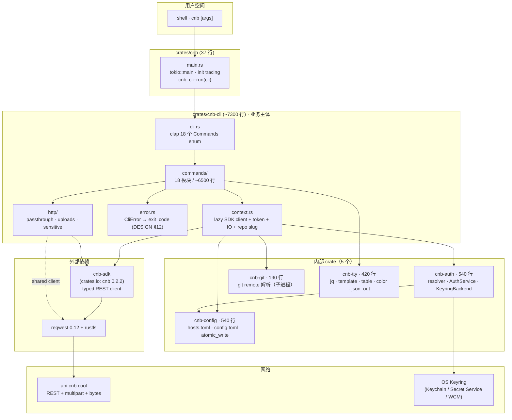
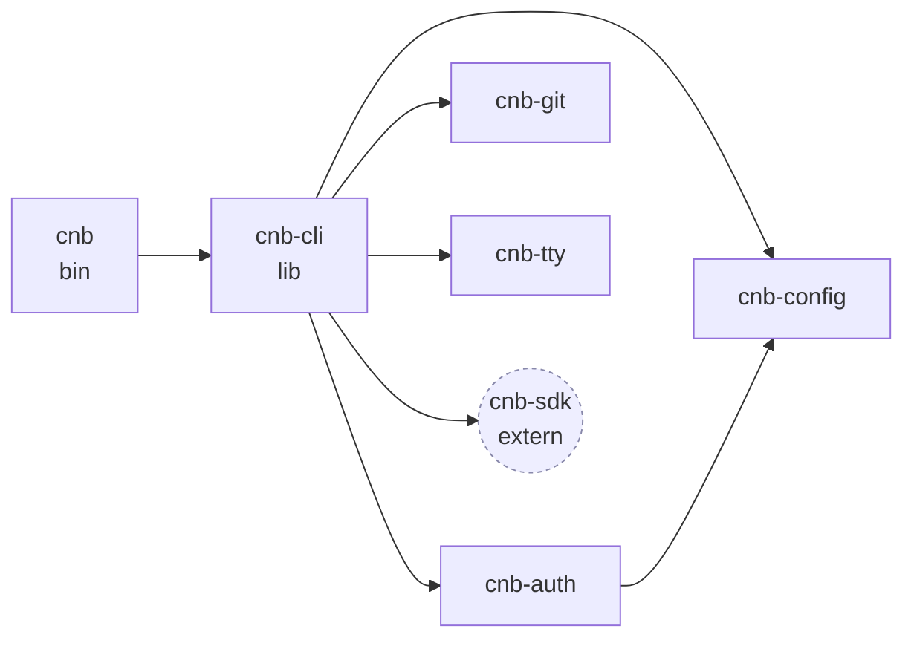
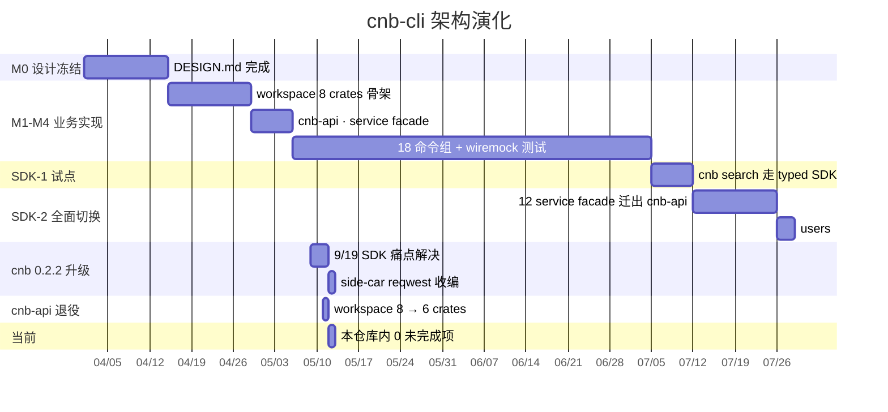

# 02 · 系统架构

## 2.1 一张图看完



**两个关键结构性事实**：

1. **`Context` 是唯一的"会话容器"** —— 所有命令都拿 `&mut Context`，从中懒构造 SDK client、token、IO streams、git slug。命令本身不持有这些。
2. **`crates/cnb-cli/src/http/`（3 模块）只承载 SDK 不建模的 HTTP 形态** —— passthrough（`cnb api`）和 multipart upload（`issue --attach`），且**复用 SDK 的 reqwest client**，连接池/auth/base URL 完全共享。

---

## 2.2 6 个 crate 的边界



**单向依赖**（无环）：

```
cnb → cnb-cli → {cnb-auth → cnb-config, cnb-git, cnb-tty, cnb-sdk(extern)}
```

每个 crate 的"为什么独立"：

| Crate | 单独成 crate 的理由 | 反例（如果合进 cnb-cli） |
|-------|--------------------|------------------------|
| **cnb-auth** | KeyringBackend trait 必须能在测试中 mock；token resolver 是纯逻辑、无 IO，便于属性测试 | 测试要么真碰 system keyring（不可移植）要么 mock 整个命令路径（笨重） |
| **cnb-config** | atomic_write + 路径解析 + schema migration 是通用工具，多个命令都用 | 这些工具混在 commands/ 里会导致命令模块大量交叉依赖 |
| **cnb-git** | 调用子进程的逻辑独立，便于将来切换到 libgit2 而不改业务码 | 业务码会到处看见 `Command::new("git")`，git 实现假设泄漏 |
| **cnb-tty** | jq / template / table 是输出格式化的"小语言"，逻辑独立、纯函数 | 输出格式逻辑会和业务逻辑纠缠，无法单独 fuzz |
| **cnb-sdk** (extern) | 上游维护、跟 OpenAPI spec 同步、可被其它 Rust 项目复用 | 我们之前有过本地的 cnb-api crate，包含 ~1500 行 generated DTO，维护负担巨大 |

---

## 2.3 HTTP 调用路径（两类 + 一个共享底座）

cnb-cli 发出去的每一个 HTTP 请求**只走两条路径**：

```mermaid
flowchart LR
    CMD[业务命令<br/>commands/*.rs] -->|大多数| TYPED["ctx.sdk()?<br/>typed call<br/>e.g. .repositories().get_repos(&q)"]
    CMD -->|cnb api raw / multipart upload| RAW["crates/cnb-cli/src/http/<br/>passthrough · uploads"]

    TYPED --> SDK_HTTP["cnb_sdk::HttpInner<br/>retry · backoff · auth · base URL"]
    RAW --> SDK_HTTP

    SDK_HTTP -->|reqwest_client()| RQCLI["reqwest::Client<br/>(共享：连接池 / TLS / DNS cache)"]
    RQCLI --> API["api.cnb.cool"]
```

**关键不变式**：`ctx.sdk()?.http().reqwest_client()` 是 cnb-cli 唯一允许的 reqwest 入口。直接 `reqwest::Client::new()` 在代码评审会被拒（**唯一例外**：`commands/release.rs:482` 的 release upload phase 2，因为目标 URL 是 pre-signed，**不应**带 `Authorization` header；此处源码注释明确说明）。

为什么这样设计：

- 共用一个 reqwest client = 共用连接池 + TLS session resumption，对 batch 操作（如 `release upload <multi files>`）可以 10x 加速
- 共用一个 client = `Authorization: Bearer …` / `User-Agent: cnb-cli/x.y.z` 等默认 header 不会写两遍，behaviour 一致
- 共用一个 client = base URL precedence（env `CNB_API_BASE` > builder.base_url > SDK 默认）只算一次

---

## 2.4 错误流（CliError → exit code）

```mermaid
flowchart LR
    SDK_ERR[cnb_sdk::ApiError] -->|#[from]| CE[CliError]
    AUTH_ERR[cnb_auth::AuthError] -->|#[from]| CE
    CFG_ERR[cnb_config::ConfigError] -->|#[from]| CE
    GIT_ERR[cnb_git::GitError] -->|#[from]| CE
    TTY_ERR[cnb_tty::TtyError] -->|#[from]| CE
    IO_ERR[std::io::Error] -->|#[from]| CE

    CE -->|.exit_code()| EC{shell exit code}
    EC --> E0[0 · OK]
    EC --> E1[1 · 通用错误]
    EC --> E2[2 · NotFound · 404 / errcode=5]
    EC --> E3[3 · BadArgs / NotImplemented]
    EC --> E4[4 · Unauthorized · 401 / errcode=16]
    EC --> E5[5 · Interrupted · Ctrl-C]
    EC --> E8[8 · RateLimited · 429 · 用户拒绝危险操作]
    EC --> E9[9 · ServerError · 5xx]
    EC --> E10[10 · Config error]
```

**为什么不直接 `process::exit`**：

- `main.rs` 只 `std::process::exit(e.exit_code())` 一次，让 `Drop` / `tracing` flush 等清理工作能走完
- 单元测试可以 `assert_eq!(err.exit_code(), 4)` 而不用 fork process
- 退出码是 DESIGN §12 公开 contract，脚本可依赖

---

## 2.5 演化简史（重要分水岭）



**4 个最重要的偏离**（与 M0 设计相比）：

1. **cnb-api crate 已删** —— 当时设计是"本地 service facade 包 progenitor 生成的 client"，演化为"直接消费上游 typed SDK + 一个 50 行的 cnb-cli::http 兜底模块"
2. **progenitor 流水线没用** —— 当时设计是 `xtask sync-openapi` 本地生成 DTO，实际是依赖外部 cnb-sdk（即 crates.io 的 `cnb` 包）
3. **cnb api raw passthrough 不再有 retry** —— 原 cnb-api 自带 retry，迁出后故意不实现（`gh api` 风格：失败立即报错）；typed SDK 仍带 retry
4. **`Context::sdk_raw_*` 用于 SDK schema 漂移兜底** —— 例如 `Repos4UserBase.flags` 字段服务端返回字符串而 SDK DTO 是 struct，相关命令（`repo list` / `search`）走 raw `serde_json::Value` 路径绕开

详细数据 / 命令变更见 [`docs/sdk-0.2.2-upgrade.md`](../sdk-0.2.2-upgrade.md)。

---

## 2.6 测试策略与 CI

| 层 | 工具 | 策略 |
|----|------|------|
| **单元测试** | 内置 `#[cfg(test)]` mod | 纯函数 / token resolver / format helpers / jq 表达式 |
| **集成测试** | `crates/cnb/tests/*.rs` + `assert_cmd` | 起 `wiremock::MockServer`，用 `CNB_API_BASE` env 把 SDK 重定向到 mock；fork `cnb` 子进程跑真实命令；assert stdout/stderr/exit code |
| **wire pinning** | wiremock `body_partial_json` / `path` matcher | 每个 SDK workaround 都有对应 pin，未来 SDK 修复后 test 自动验证一致 |
| **doc-tests** | `///` 中的代码块 | cnb-auth / cnb-config / cnb-git / cnb-tty 都有 |
| **格式 & lint** | `cargo fmt --check` + `cargo clippy --workspace --all-targets -- -D warnings` | CI 必跑 |
| **依赖审查** | `cargo deny`（配置在 `deny.toml`） | license / advisories / 重复依赖 |

**当前数字**：179 测试 passed / 0 failed / 0 ignored。详见 [06 § CI/CD](./06-developer-guide.md)。

下一步推荐阅读：[03 核心模块功能](./03-modules.md)。
