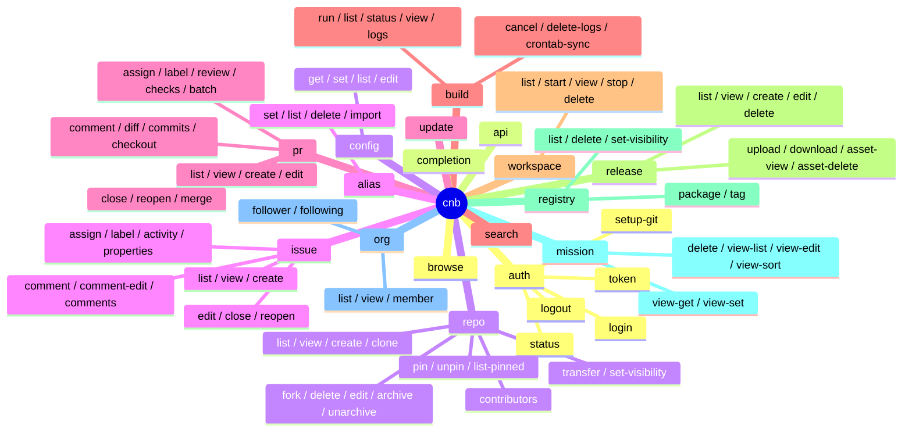

# 04 · 命令清单与端点映射

> 18 个命令组、~95 个子动词、~9000 行业务代码的鸟瞰图。
> **怎么看**：第一列是 `cnb` 子命令，第二列是它内部用什么 `cnb-sdk` 接口或裸 HTTP 路径，第三列是出错时常见的 exit code。

---

## 4.0 全局规则

### 输出三种模式（任何命令）

```bash
cnb <cmd> --json                 # 全量原始 JSON
cnb <cmd> --jq '.[].field'       # jq 表达式过滤
cnb <cmd> --template '{{name}}'  # tinytemplate 渲染
# 默认 = 人类友好（TTY 时表格 + 颜色，pipe 时 TSV + 无颜色）
```

### 全局 flag

| flag | env | 用途 |
|------|------|------|
| `--hostname <host>` | `CNB_HOST` | 选 cnb 实例（默认 `cnb.cool`） |
| `--verbose` / `-v` / `-vv` | — | tracing level（`-v` info，`-vv` debug） |
| `--help` / `-h` | — | clap 自动生成 |
| `--version` / `-V` | — | clap 自动生成 |
| 隐式 | `CNB_TOKEN` | token 第一优先级 |
| 隐式 | `CNB_API_BASE` | base URL override（测试用） |
| 隐式 | `CNB_KEYRING_BACKEND` | `real`/`memory`，CI 用 `memory` |

### 退出码（DESIGN §12）

| code | 含义 |
|----:|------|
| 0 | OK |
| 1 | 通用错误 |
| 2 | NotFound（404 / errcode=5） |
| 3 | BadArgs / NotImplemented |
| 4 | Unauthorized（401 / errcode=16） |
| 5 | Interrupted（Ctrl-C） |
| 8 | RateLimited（429）/ 用户拒绝危险操作 |
| 9 | ServerError（5xx） |
| 10 | Config error |

---

## 4.1 命令组 × 子动词总表

| 命令组 | 子动词数 | 主要 SDK 入口 | 备注 |
|------|----:|------|------|
| [`auth`](#42-auth) | 5 | `users::get_user_info`（验证 token）+ `cnb-auth` 本地 | login / logout / status / token / setup-git |
| [`api`](#43-api) | （无子动词，直接 `cnb api PATH`） | **`crates/cnb-cli/src/http/passthrough`** | 通用 REST 直通 |
| [`repo`](#44-repo) | 15 | `client.repositories()` + 部分 `sdk_raw_*` | 含 `set-visibility` / `pin` workaround |
| [`issue`](#45-issue) | 13 | `client.issues()` + `http::uploads`（`--attach`） | `list` 默认 = 跨仓库（commit `666ba20`） |
| [`label`](#46-label) | 4 | `client.labels()` | 简单 CRUD |
| [`pr`](#47-pr) | 16 | `client.pulls()` | 含 `diff` / `commits` / `checkout` / `merge` / `review` / `checks` / `batch` |
| [`build`](#48-build) | 8 | `client.pipelines()` + `sdk_raw_get_bytes`（`logs`） | logs 走 raw bytes |
| [`workspace`](#49-workspace) | 5 | `client.workspaces()` | 云 IDE 管理 |
| [`release`](#410-release) | 9 | `client.releases()` + raw bytes（`download`）+ side-car reqwest（`upload phase 2`） | upload phase 2 故意保留独立 client（pre-signed URL 不能带 auth） |
| [`registry`](#411-registry) | 5+ | `client.registries()` + 子组 package/tag | 制品仓库 |
| [`mission`](#412-mission) | 6 | `client.missions()` + `sdk_raw_*` | 任务集合 + view 配置 |
| [`org`](#413-org) | 5+ | `client.organizations()` / member subgroup | 组织 + 成员管理 |
| [`browse`](#414-browse) | 0 | `cnb-git` slug + `open` crate | 在浏览器打开 cnb 页面 |
| [`completion`](#415-completion) | 0 | `clap_complete` | shell 补全脚本生成 |
| [`config`](#416-config) | 4 | `cnb-config` 本地 | 用户偏好读写 |
| [`alias`](#417-alias) | 4 | `cnb-config` 本地 | 命令别名管理 |
| [`update`](#418-update) | 0 | GitHub releases API | 检查 cnb 自身新版 |
| [`search`](#419-search) | 0 | 兜底 raw `/search/public-repos` | DTO 漂移走 raw |

合计 **≈ 95 个子动词**。

---

## 4.2 `auth`

| 子动词 | 用途 | 入口 |
|------|------|------|
| `login` | 输入 PAT，写入 keyring，调 `users::get_user_info` 验证身份 | `cnb_auth::AuthService::login` + `Context::sdk_with_token` |
| `logout` | 删除 host/user 的 keyring + hosts.toml 条目 | `AuthService::logout` |
| `status` | 显示当前 host / user / token 来源 / 有效性 | `AuthService::status` + `Context::sdk_with_token` |
| `token` | 把 active token 打到 stdout（脚本用） | `cnb_auth::resolve_token` |
| `setup-git` | 把 cnb token 注册成 git credential helper | 写 `~/.gitconfig` |

**安全**：所有写文件操作走 `cnb_config::atomic_write` + `0600` mode。

---

## 4.3 `api`

```bash
cnb api PATH [-X METHOD] [-H "K: V"] [-f field=value] [-F field=@file] [-i] [--silent] [--jq EXPR] [--template TPL] [--paginate]
```

**唯一不通过 SDK typed client 的命令**。直接 `crates/cnb-cli/src/http/passthrough::request` 发请求。

| flag | 用途 |
|------|------|
| `-X METHOD` | HTTP method（默认 `GET`，有 `-f` / `-F` 时默认 `POST`） |
| `-H` | 额外 header |
| `-f` | JSON body field（`name=value` → `{"name":"value"}`） |
| `-F` | field-from-file（`name=@path` → 读文件内容作为字符串字段） |
| `-i` | 打印响应 status + headers（敏感 header 自动 redact 为 `***`） |
| `--silent` | 4xx/5xx 不映射到 `CliError`，只把 raw body 打到 stdout（脚本调试用） |
| `--jq` / `--template` | 同全局 |
| `--paginate` | 自动跟随 `Link: rel="next"` 分页 |

**与 typed call 的区别**：

- 没有 retry（typed SDK 内置 backoff 重试，passthrough 立即冒泡）
- 不过 SDK DTO 解码（拿 raw body）
- 所有 4xx/5xx → `CliError::Unauthorized` / `NotFound` / `RateLimited` / `ServerError`，DESIGN §12 退出码不变

---

## 4.4 `repo`

| 子动词 | SDK 调用 | 备注 |
|------|------|------|
| `list [TARGET]` | **`sdk_raw_get`**（`Repos4UserBase.flags` DTO 漂移 workaround） | 三种 dispatch：无 target → `/user/repos`；`group/sub` → `/{slug}/-/repos`；`username` → `/users/{u}/repos` |
| `view <slug>` | `client.repositories().get_repo` | |
| `create` | `client.repositories().create_*_repo`（按 owner kind 分发） | |
| `clone` | 调 `git clone` 子进程 | 走 `cnb-git` |
| `fork [list]` | `client.repositories().list_forks_repos` | |
| `delete` | `client.repositories().delete_repo` | 二次确认提示，拒绝 → exit 8 |
| `edit` | `client.repositories().patch_repo` | |
| `archive` / `unarchive` | `client.repositories().archive_repo` / `unarchive_repo` | |
| `transfer` | `client.repositories().transfer_repo` | |
| `set-visibility` | `client.repositories().set_repo_visibility` | wire shape **未确认**（known-gaps #6） |
| `pin` / `unpin` / `list-pinned` | `client.repositories().set_pinned_repo_by_group` 等 | M4，wire shape 0.2.2 后已统一 |
| `contributors` | raw GET `.../contributors` | M4 |

---

## 4.5 `issue`

| 子动词 | SDK 调用 | 备注 |
|------|------|------|
| `list [REPO]` | 无 REPO → `client.issues().list_user_issues`；有 REPO → `client.issues().list_issues` | **默认跨仓库**（commit `666ba20` BREAKING）；表格在跨仓库模式带 `REPO` 列 |
| `view <number>` | `client.issues().get_issue` | 用 `IssueDetail` 单调 |
| `create [-t -b -a -l --attach]` | `client.issues().post_issue` + 可选 `http::uploads::upload_one` | `--attach` 走 multipart |
| `edit` | `client.issues().patch_issue` | |
| `close` / `reopen` | `client.issues().patch_issue`（state 字段） | |
| `comment [-b --attach]` | `client.issues().post_issue_comment` + 可选 multipart | |
| `comment-edit` | `client.issues().patch_issue_comment` | |
| `assign` / `label` | `client.issues().post_issue_assignees` 等 | |
| `comments` | `client.issues().list_issue_comments` | |
| `activity` | `client.issues().list_issue_activities` | M3 |
| `properties [view/set]` | `client.issues().get_issue_properties` / `put_issue_properties` | M3 |

---

## 4.6 `label`

| 子动词 | SDK 调用 |
|------|------|
| `list` | `client.labels().list_labels` |
| `create` | `client.labels().post_label` |
| `edit` | `client.labels().patch_label_by_name` |
| `delete` | `client.labels().delete_label_by_name` |

---

## 4.7 `pr`

| 子动词 | SDK 调用 | 备注 |
|------|------|------|
| `list [REPO]` | `client.pulls().list_pulls`（**仅 repo-scoped**） | 跨仓库视图 = 平台暂无 `/user/pulls`，known-gaps #16 |
| `view <number>` | `client.pulls().get_pull` | |
| `create` | `client.pulls().post_pull` | |
| `edit` / `close` / `reopen` | `client.pulls().patch_pull` | |
| `comment` | `client.pulls().post_pull_comment` | |
| `diff` | `client.pulls().get_pull_diff` | 输出 unified diff |
| `commits` | `client.pulls().list_pull_commits` | |
| `checkout` | 调 `git fetch + checkout` 子进程 | 本地 git 操作 |
| `assign` / `label` | `client.pulls().post_pull_assignees` 等 | |
| `merge` | `client.pulls().merge_pull` | 二次确认 |
| `review` | `client.pulls().post_pull_review` | M3 |
| `checks` | `client.pulls().list_pull_checks` | M3 |
| `batch` | 多 `get_pull` 并发 | M3，并发数 = 8 |

---

## 4.8 `build`

| 子动词 | SDK 调用 | 备注 |
|------|------|------|
| `run` | `client.pipelines().run_pipeline` | |
| `list` | `client.pipelines().list_pipelines` | |
| `status <sn>` | `client.pipelines().get_pipeline_status` | |
| `view <sn> <stage>` | `client.pipelines().get_pipeline_stage_log` | |
| `logs <sn>` | **`Context::sdk_raw_get_bytes`** | text/plain 大文件流 |
| `cancel <sn>` | `client.pipelines().cancel_pipeline` | |
| `delete-logs <sn>` | `client.pipelines().delete_pipeline_logs` | 二次确认 |
| `crontab-sync` | `client.pipelines().sync_crontab` | |

---

## 4.9 `workspace`

| 子动词 | SDK 调用 |
|------|------|
| `list` | `client.workspaces().list_workspaces` |
| `start <repo>` | `client.workspaces().create_workspace` |
| `view <sn>` | `client.workspaces().get_workspace` |
| `stop <sn>` | `client.workspaces().stop_workspace` |
| `delete <sn>` | `client.workspaces().delete_workspace` |

---

## 4.10 `release`

| 子动词 | SDK 调用 | 备注 |
|------|------|------|
| `list` | `client.releases().list_releases` | |
| `view [tag\|--id\|--latest]` | `client.releases().get_release_*` | 三种 lookup |
| `create` | `client.releases().post_release` | |
| `edit --id` | `client.releases().patch_release` | |
| `delete --id` | `client.releases().delete_release` | 二次确认 |
| `upload --id <files...>` | phase 1：`client.releases().request_upload` typed；phase 2：**裸 reqwest**（pre-signed URL，故意不带 auth header） | 详见 [02 § HTTP 路径](./02-architecture.md) |
| `download <tag> <name>` | **`Context::sdk_raw_get_bytes`** | 302 → bytes |
| `asset-view` | `client.releases().get_release_asset` | |
| `asset-delete` | `client.releases().delete_release_asset` | 二次确认 |

---

## 4.11 `registry`

| 子动词 | SDK 调用 |
|------|------|
| `list <group>` | `client.registries().list_registries` |
| `delete` | 二次确认 + `client.registries().delete_registry` |
| `set-visibility` | `client.registries().set_registry_visibility` |
| `package <subcmd>` | npm/maven/docker/... 子树（M4） |
| `tag <subcmd>` | 包 tag 管理（M4） |

---

## 4.12 `mission`

| 子动词 | SDK 调用 |
|------|------|
| `delete` | `client.missions().delete_mission` |
| `view-list` | `client.missions().list_mission_views` |
| `view-edit` | `client.missions().put_mission_views` |
| `view-sort` | `client.missions().sort_mission_views` |
| `view-get` / `view-set` | `client.missions().get_mission_view` / `set_mission_view` |

---

## 4.13 `org`

| 子动词 | SDK 调用 | 备注 |
|------|------|------|
| `list` | `client.organizations().list_my_groups` | |
| `view <slug>` | `client.organizations().get_organization` | |
| `member <subcmd>` | `client.organizations().*_members` | wire shape **未确认**（known-gaps #7） |
| `follower` / `following` | `client.organizations().list_followers` 等 | |

---

## 4.14 `browse`

```bash
cnb browse [PATH]    # 在浏览器打开 https://cnb.cool/<slug>/<PATH>
cnb browse --pr 123  # 打开 PR 页
cnb browse --issue 5 # 打开 issue 页
```

无 SDK 调用；`cnb-git` 拿 slug + `open` crate 调用系统浏览器。

---

## 4.15 `completion`

```bash
cnb completion bash > /etc/bash_completion.d/cnb
cnb completion zsh  > ~/.zsh/completion/_cnb
cnb completion fish > ~/.config/fish/completions/cnb.fish
```

`clap_complete` 直接生成。

---

## 4.16 `config`

| 子动词 | 实现 |
|------|------|
| `get <key>` | 读 `Config`，按点路径取值 |
| `set <key> <value>` | 写 `Config`，atomic_write |
| `list` | 全量 dump |
| `edit` | `Config::file_path` + `$EDITOR` |

支持的 key 约 15 个（editor / pager / color / output 默认 / aliases.* / ...）。详见 `commands/config.rs` 顶部表。

---

## 4.17 `alias`

| 子动词 | 实现 |
|------|------|
| `set <name> "<expansion>"` | 写 `Config.aliases` |
| `list` | dump aliases |
| `delete <name>` | 删一条 |
| `import <file.toml\|.json>` | 批量导入 |

alias 在 `cnb` 入口被 expand（实际位置：`cli.rs` 解析 argv 前）。

---

## 4.18 `update`

```bash
cnb update             # 检查 GitHub release 是否有更新
cnb update --silent    # 静默检查（用于 wrapper 脚本）
```

调 GitHub API（**不是 cnb.cool**！这是 cnb-cli 自身的发布渠道），与 SemVer 比对。

---

## 4.19 `search`

```bash
cnb search rust --order_by stars --desc --top_n 50
```

走兜底 raw `/search/public-repos`（`Repos4UserBase` DTO 漂移 workaround，与 `repo list` 同源）。

---

## 4.20 命令拓扑速查



下一步推荐阅读：[05 核心数据流](./05-data-flows.md)。
