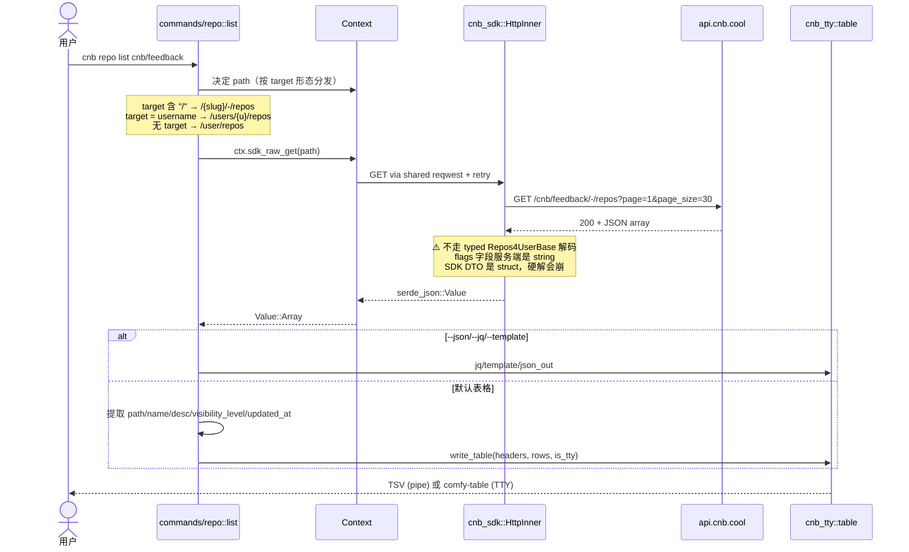
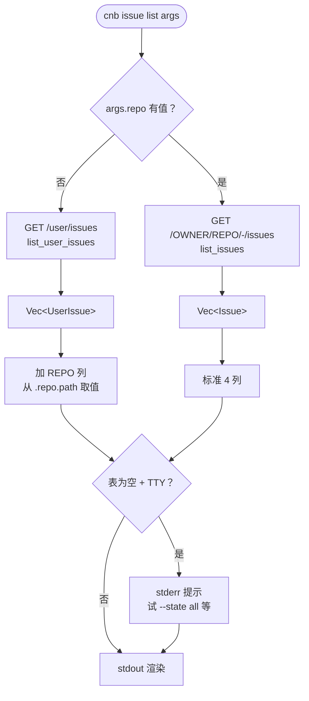
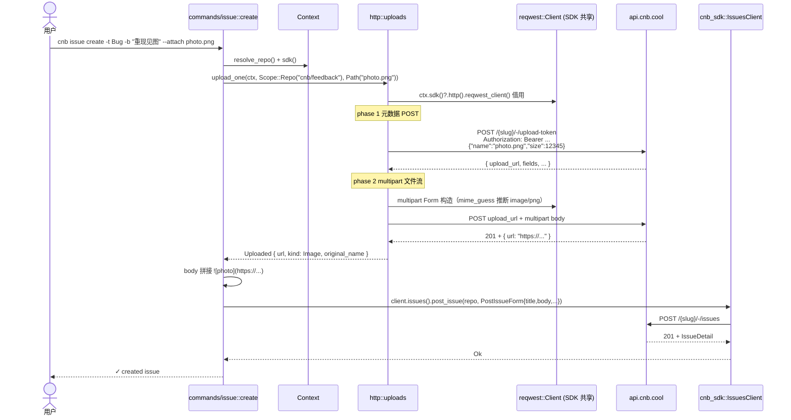
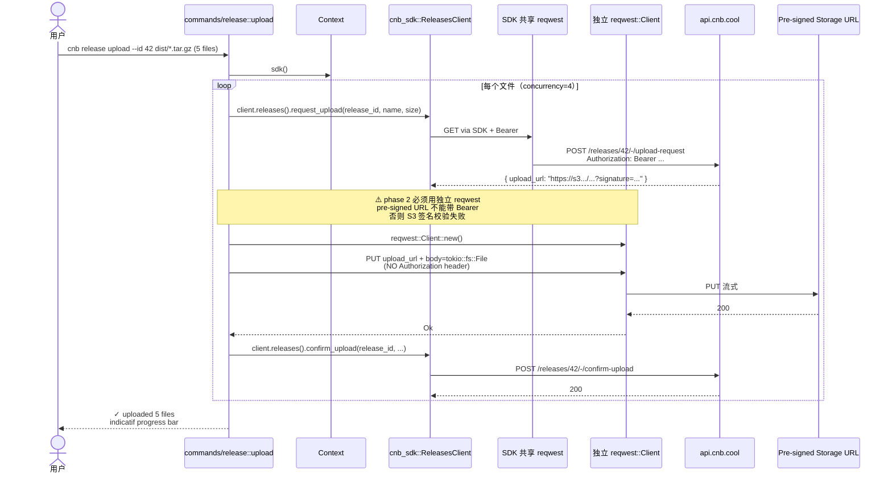
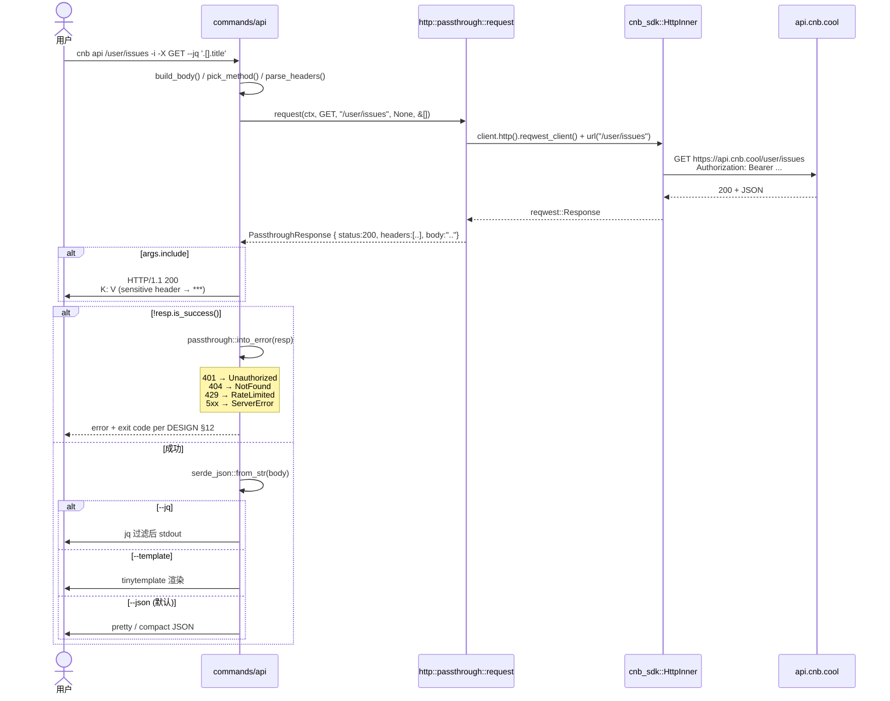

# 05 · 核心数据流

> 5 个最关键的端到端流程，每个一张时序图 + 关键设计点。
> **目的**：让你在调试 / 性能分析 / 加 retry / 改 token 流程时，一眼看到全链路。

---

## 5.1 `cnb auth login` —— 拿 token、验证、落盘

```mermaid
sequenceDiagram
    actor U as 用户
    participant CLI as cnb (bin)
    participant CMD as commands/auth::login
    participant CTX as Context
    participant AS as cnb_auth::AuthService
    participant SDK as cnb_sdk::ApiClient
    participant API as api.cnb.cool
    participant KR as OS Keyring
    participant FS as hosts.toml

    U->>CLI: cnb auth login
    CLI->>CMD: run(ctx, args)
    CMD->>U: dialoguer Password prompt
    U-->>CMD: PAT (token 字符串)
    CMD->>CTX: ctx.sdk_with_token(token) 一次性 client
    CTX->>SDK: ClientBuilder::new().token(token).build()
    CMD->>SDK: users().get_user_info()
    SDK->>API: GET /user (Bearer ...)
    API-->>SDK: 200 + UserInfo 或 401
    alt 401
        SDK-->>CMD: ApiError::Api { http_status: 401 }
        CMD-->>U: error: invalid token; exit 4
    else 200
        SDK-->>CMD: UserInfo { username, ... }
        CMD->>AS: AuthService::login(host, username, token)
        alt RealKeyring
            AS->>KR: keyring::Entry::set_password(token)
        else InMemoryKeyring (test)
            AS->>AS: 内存 map.insert
        end
        AS->>FS: atomic_write hosts.toml<br/>(0600 mode, default_user 更新)
        AS-->>CMD: Ok
        CMD-->>U: ✓ Logged in to <host> as <username>
    end
```

### 关键设计点

- **`sdk_with_token` 是一次性 client** —— 用用户输入的 token 立即跑 `users().get_user_info()` 验证；验证通过才落盘
- **token 落盘前必先验证** —— 避免错的 token 被 cache，下次报错时排查路径长
- **三段降级在落盘**：keyring 写失败 → 仍写 hosts.toml 的 `token = ...` 字段（带警告）；hosts.toml 写失败 → 整个登录失败、不留半状态

---

## 5.2 `cnb repo list` —— SDK DTO 漂移兜底



### 关键设计点

- **`Context::sdk_raw_get` 而不是 typed `client.repositories().get_repos(&q)`** —— 因为 SDK 0.2.2 的 `Repos4UserBase.flags` 字段类型是 `Option<Repo>`，但服务端实际返回字符串（如 `"Unknown"`）
- **raw 路径仍**通过 SDK 的 `HttpInner`，**保留** retry / Authorization / base URL，**只是跳过 DTO 解码**
- **`flags` 字段全程不读** —— 渲染只用 5 个字段，DTO 兜底零成本
- **`cnb search` 同模式** —— `Repos4UserBase` 是同源 DTO

未来 SDK 修复后可以一键回退到 typed call，源码注释里已经留了 marker。

---

## 5.3 `cnb issue list`（默认跨仓库视图）



### 关键设计点

- **默认无 slug → 跨仓库** —— 与用户直觉对齐（"我跑 issue list 想看我所有的 issue"）；commit `666ba20` BREAKING change
- **不再从 git remote 自动推断** —— 之前在仓库目录跑命令会被静默 narrow，是 footgun，已移除
- **跨仓库表加 REPO 列** —— 否则你不知道每行属于哪个仓库
- **空表 TTY hint** —— 区分"过滤掉了"和"命令静默挂了"
- **`cnb pr list` 同款不能做** —— 平台暂无 `/user/pulls`（known-gaps #16），保持 repo-scoped + 显式 hint

---

## 5.4 `cnb issue create --attach photo.png` —— multipart upload



### 关键设计点

- **复用 SDK 的 reqwest client** —— 一次 connection pool / TLS handshake，多次请求；Bearer token 由 client 默认 headers 自动附加
- **mime_guess 推断 kind** —— `image/*` → `Kind::Image`，markdown 拼成 ``；其它 → `Kind::Other`，拼成 `[name](url)`
- **两阶段失败时 issue 不会创建** —— 上传失败立即 `Err`，issue typed POST 根本不会发出
- **不在 typed SDK 里** —— SDK 不建模 multipart，但通过 `reqwest_client()` 借用我们自己干

---

## 5.5 `cnb release upload v1.0 dist/cnb-*.tar.gz`（多文件并发上传）



### 关键设计点

- **唯一允许的独立 reqwest::Client** —— 因为 pre-signed URL 自带签名验证机制，**不应**附加 `Authorization` header；SDK 的共享 client 永远附 Bearer，行为不符
- **源码 `commands/release.rs:482` 有显眼注释** —— 评审时不会有人误删除独立 client
- **并发数 = 4** —— 平衡服务端压力和上传吞吐
- **indicatif 进度条** —— TTY 下显示，pipe 时退化为日志行
- **失败半成品不留** —— 任一文件失败立即 Err，已 confirm 的不撤销（用户可重跑 upload，平台幂等）

---

## 5.6 `cnb api` —— 通用 REST 直通



### 关键设计点

- **复用 SDK reqwest** —— bearer / base URL / TLS 都由 SDK 默认 header 注入
- **不实现 retry** —— `cnb api` 是 `gh api` 风格的调试逃生门，失败立即冒泡（typed call 里 SDK 仍带 retry）
- **敏感 header redact** —— `--include` 时通过 `http::sensitive::is_sensitive(name)` 判断，22 个 header 名字（authorization / cookie / set-cookie / x-api-key 等）替换成 `***`
- **完整 exit code 契约** —— 4xx/5xx 响应映射到 `CliError::{Unauthorized, NotFound, RateLimited, ServerError}`，与 typed call 完全等价

---

## 5.7 通用模式总结

读完上面 5 个数据流，可以提炼出 cnb-cli 的几条**普适架构模式**：

| 模式 | 体现在 |
|------|------|
| **`Context` 是会话单例**，命令拿 `&mut Context` | 所有命令 |
| **SDK typed call 是默认路径** | 5.1 / 5.4 / 5.5 phase 1/3 |
| **`sdk_raw_*` 在 DTO 漂移时兜底** | 5.2 / 5.3 / `cnb search` |
| **`http::passthrough` / `http::uploads` 在 SDK 不建模时兜底** | 5.4 / 5.6 |
| **独立 reqwest 仅 release upload phase 2** | 5.5（设计取舍，源码有锚点注释） |
| **错误模型统一到 `CliError` + `exit_code()`** | 全部 |
| **TTY vs pipe 行为分支** | 5.2 / 5.3（表格 vs TSV）/ 5.5（progress bar 显隐）|

下一步推荐阅读：[06 二次开发指南](./06-developer-guide.md)。
